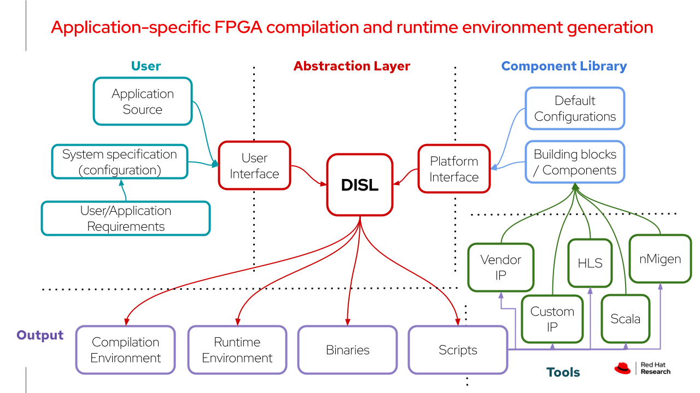
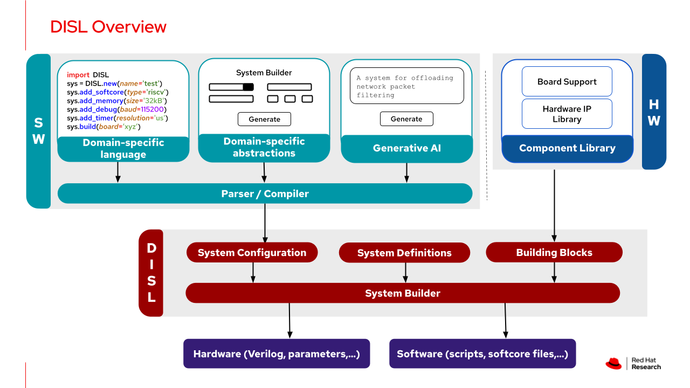
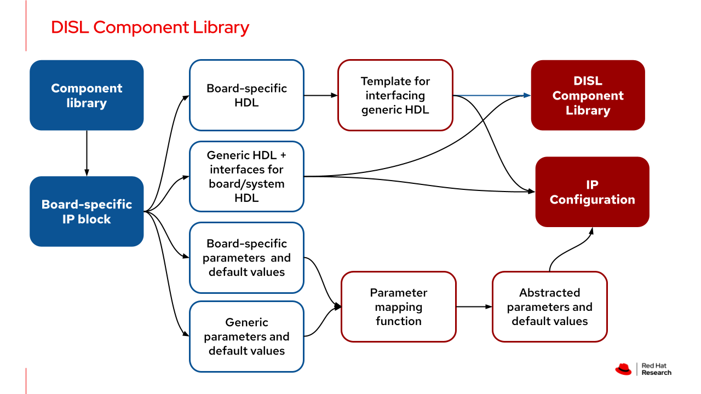
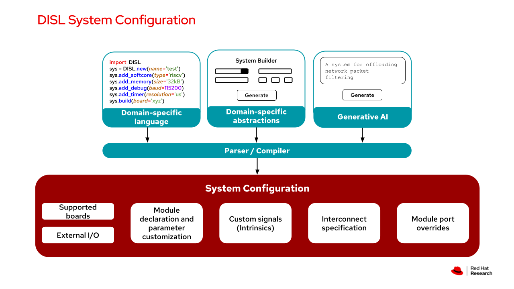
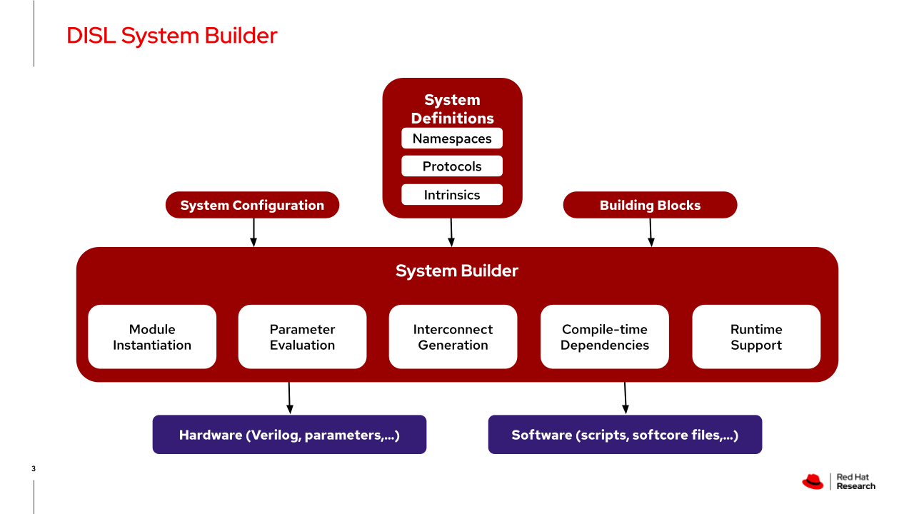

# DISL
DISL provides an abstraction layer for application-specific generation of FPGA compilation and runtime environments. 




Some advantages of DISL are:
- It allows application and system developers to innovate independently of each other, whilst providing the mechanisms for technology transfer between them.
- System developer only need to focus on providing the system building blocks, the parameters used to configure them, and the default values for these parameters - they don't have to support the different ways in which these blocks are used.
- Application developers only need to provide their program + a configuration file that defines application requirements - the configuration file itself can be generated through further abstractions, such as Domain Specific Languages and Generative AI, and can leverage supplied building block defaults to get something up and running with little overhead.
- DISL can be used to build anything from a single wire, to an arbitrary sized full adder, to a highly customized Multi-Processor System on Chip - virtually anything you could do with existing hardware development languages, you can do with DISL. 
- A single building block can encapsulate an arbitrary amount of functionality since we only need to define the top most module of the building block - everything else can be defined across any number of modules and files.
- DISL is extensible. From target boards, to building blocks, to supported protocol interfaces, to the system building process - nearly everything about DISL can be customized to further tailor it as needed.
- The effort needed to do verification is substantially reduced since this can be done at the configuration file level, rather than at the HDL level. 
- DISL generates interconnects based on well defined interfaces that encapsulate the functionality of individual signals. This in turn allows multiple protocols to talk to each other (including custom protocols), with automatic bridging between them. 
- System developers can still use their choice of non-HDL language for building blocks, such as Scala and nMigen, as long as the highest level interface of the resulting module has been added to DISL.
- DISL can also be used as an abstraction layer for existing FPGA system generation frameworks, such as those based on Scala and nMigen. That is, DISL can be used to translate user requirements to scripts used as inputs for these frameworks. 
- DISL can be used with virtually any Synthesis and Place & Route tooling. It also supports IP block usage from vendor IP libraries

<br/>

## Contents
 - [Quick start guide](#quick-start-guide)
 - [Overview](#overview)
 - [Directory tree](#directory-tree)
 - [System definitions](#system-definitions)
 	- [Namespaces](#namespaces) 
 	- [Interconnects](#interconnects) 
 	- [Intrinsics](#intrinsics) 
 	- [Handshakes](#handshakes) 
 	- [Protocol Interfaces](#protocol-interfaces) 
 - [Component library](#component-library)
	- [Step 1: Pre processing](#step-1-pre-processing)
	- [Step 2: Board support](#step-2-board-support)
 	- [Step 3: Hardware IP library](#step-3-hardware-ip-library)
	- [Step 4: Parameter mapping function](#step-4-parameter-mapping-function)
	- [Case study: Adding a UART component](#case-study-adding-a-uart-component)
	- [Out of the box support](#out-of-the-box-support)
 - [Project directory structure](#project-directory-structure)
 - [System Configuration](#system-configuration)
	- [Naming conventions](#naming-conventions)
	- [Meta data](#meta-data)
	- [External IO](#external-io)
	- [Instantiation](#instantiation)
	- [Intrinsics](#intrinsics)
	- [Interconnect](#interconnect)
 - [System builder](#system-builder)
 	- [Step 1: Initialize the BUILD class](#step-1-initialize-the-build-class)
  	- [Step 2: Create helper functions](#step-2-create-helper-functions)
   	- [Step 3: Generate the top module](#step-3-generate-the-top-module)
  	- [Step 4: Generate constraints](#step-4-generate-constraints)
   	- [Step 5: Generate TCL scripts for IP blocks](#step-5-generate-tcl-scripts-for-ip-blocks)
   	- [Step 6: Get required files](#step-6-get-required-files)
 - [Running DISL](#running-disl)
 - [PyJTAP: Lightweight implementation of FTDI MPSSE in python](#pyjtap)
 - [Examples](#examples)
<br/>


## Quick start guide
Requirements:
- Python 3.x
- Xilinx 7 series FPGA board with a FT2232H chip (Cmod A735t and Arty A735t supported out of box)
- Python libraries given in ```requirements.txt```
- riscv64-linux-gnu toolchain

Additional requirements if the precompiled binaries are not used:
- Vivado

To generate, compile and deploy the hardware for an edgetestbed example system, run the following command from this directory 
```console
python configure.py --example_dir ./examples/edgetestbed --example <example> --board <cmoda735t|artya735t> --build_dir build
cd build
source run.sh
make
python test.py  
```

If using a precompiled binary:
```console
python configure.py --example_dir ./examples/edgetestbed --example <example> --board <cmoda735t|artya735t> --build_dir build
cd build
mkdir -p <example>/<example>.runs/impl_1
cp ../examples/edgetestbed/precompiled_binaries/<example>.bin <example>/<example>.runs/impl_1/top.bin
make
python test.py
```
<br/>


Tested with:
- Fedora 37, Python 3.11, Vivado 2020.1


## Overview

The figure below gives an overview of DISL. There are five major pieces here:
- **`System Definitions`**: Gives context to the system building process
- **`Hardware IP Library`**: Building blocks used to construct the target system 
- **`Board Support`**: Configuration files for defining board specific information
- **`System Configuration`**: User application requirements for the target system
- **`System Builder`**: Methods for generating the target system using the above four pieces. The system builder currently generates Verilog based `top` modules. 


<br/>


## Directory Tree
The directory structure of DISL is shown below, along with the function of each significant file/folder.

```bash
.
├── configure.py					# Used to run DISL
├── examples						# Default directory for DISL examples - can be changed by user
│   ├── <project_category_1>				# Projects can be organized into different categories
│   │   ├── <project_1>					# Project folder - should always contain a 'system.tml' file and 'src' folder
│   │   │   ├── src					# This folder is copied over as is to the build folder - can be used to: override DISL generated files in the build directory, provide files that DISL does not generate, or it can even be left empty
│   │   │   │   ├── <custom_module_implementations.v>	# Example - can be use to replace an existing DISL building block(s), provided the interface is the same
│   │   │   │   ├── <softcore_code.c>			# Example - source code(s) to run on FPGA softcore(s)
│   │   │   │   ├── <custom_softcore_routines.S>	# Example - routine(s) required to compile the softcore code
│   │   │   │   ├── <Makefile>				# Example - Makefile for compiling softcore code(s)
│   │   │   │   └── <host.py>				# Example - code(s) to run on the host
│   │   │   └── system.tml				# System configuration file - defines the target system based on user requirements
│   │   └── <project_2>					# Additional project(s) within the same category
│   └── <project_category_2>				# Additional project categories
└── fpga						# Contains the FPGA pieces needed to build the system
    ├── boards						# Directory for board specific data
    │   └── <board_name>				# Name of the supported board
    │       ├── config					# Folder containing board configuration files
    │       │   ├── board.tml				# Describes board meta data, capabilities, external IO interfaces, constraints, supported board-specific modules etc.
    │       │   └── defaults.tml			# Provides a list of default values for board specific parameters of supported hardware components
    │       └── src					# Contains implementions of (or methods for generation) board specific modules
    │           ├── hdl					# Pre-implemented modules
    │           └── ip					# Files used to generate IP from target tooling e.g. '.prj' files for Vivado
    ├── common						# Directory for board independent data
    │   ├── config					# Folder containing configuration files needed to run DISL
    │   │   ├── defaults.tml				# Default values of generic parameters of supported hardware components
    │   │   ├── definitions.tml				# Gives context to the DISL system builder
    │   │   └── modules.tml				# Interface definitions, parameter definitions and board dependencies of supported hardware components
    │   └── hdl						# Generic implementations of modules in the hardware IP library
    └── system_builder					# Contains scripts needed to run the system builder and pre/post build verification - verification will added in the future
        └── build.py					# DISL system builder

```


## System Definitions

System definitions are used to ensure that the different components of DISL are able to function together, even if they are built independently. These definitions establish a nomenclature that must be used by all DISL configuration files. Moreover, they also identify the capabilities of the current DISL version so that configuration files can be verified for correctness/completeness. As with almost every other part of DISL, system definitions are customizable and extensible - they can be tailored based on user or domain requirements. System definitions are given in `fpga/common/config/definitions.tml`, and the methods of specifying them + current support is described in detail below. 
<br/>


### Namespaces
Namespaces in DISL have a similar purpose to namespaces in software - signals and protocol interfaces can have the same names for different components in the design, especially since they are being built by different people. For example, both the board and a memory controller module can have an interface named `ddr`. When specifying connectivity, we would need to clarify that it is the `MODULE:ddr` that is driving the `BOARD:ddr` - here, `MODULE` and `BOARD` are two different namespaces.
  
#### Method
To define a namespace, add it as a key under the `NAMESPACES` dictionary in [definitions.tml](fpga/common/config/definitions.tml), and assign it a list. The list can be left empty since it is not used by the system builder, or information can be given in this list for use during a verification step.
```toml
[NAMESPACES]
NAMESPACE_1_NAME = ["<Optional_Information>","..."]
NAMESPACE_2_NAME = ["<Optional_Information>","..."]
"..." = ["..."]
```

#### Current support
DISL supports the following namespaces out of the box:
- **`MODULE`**: [Module](#hardware-ip-library) signals.
- **`BOARD`**:  Board's [external I/O signals](#external-io).
- **`CONSTANT`**: Hardwired signals - either '1' (hardwired to VCC) or '0' (hardwired to GND).
- **`CUSTOM`**: Signals generated through [intrinsics](#intrinsics).
- **`INTERNAL`**: Signals generated through [intrinsics](#intrinsics), but cannot be connected to anything outside the [intrinsic](#intrinsics) hardware.
- **`PARAMETER`**: Values assigned to [module](#hardware-ip-library) parameters.
- **`SYSTEM`**: Values assigned to fields in the [system configuration](#system-configurtion) file.
- **`BUSCONTENTION`**: Intermediate signals create to resolve bus contention.
	- When resolving bus contentions, a secondary set of namespaces are used that are named after the [handshakes](#handshakes) from which they are getting signals. Since this is a special case that is handled by the system builder, these namespaces don't need to be formally defined here. And unlike the namespaces above, these secondary namespaces are constrained to be names of handshakes.
<br/>


### Interconnects
This is used to define the types of interconnects supported by DISL. It could be one or more traditional interconnects (one-to-one, one-to-many, many-to-one, many-to-many), as well as any unique interconnects that are supported by the user's version of DISL. Supporting an interconnect requires adding the interconnect's rules to the system builder script, and ensuring that sufficient information is provided in an appropriate structured manner in the user's [system configuration](#system-configurtion). 
  
#### Method
To add/modify/remove an interconnect type, update the `TYPES` list in the `INTERCONNECTS` dictionary in [definitions.tml](fpga/common/config/definitions.tml).
```toml
[INTERCONNECTS]
TYPES = ["TYPE_1", "TYPE_2", "..."]
```

#### Current support
DISL supports `ONE_TO_ONE` and `ONE_TO_MANY` out of the box. `MANY_TO_ONE` and `MANY_TO_MANY` are not currently supported since they require an arbitration policy to be implemented. However, it is possible to emulate these forms of connectivity by generating the select signals using modules and/or intrinsics, and then creating a [dynamic interconnect](#dynamic-interconnect). 
<br/>


### Intrinsics
Intrinsics are used to define hardware constructs without creating modules. This reduces turnaround for creating control paths, making minor hardware changes, fine tuning the system etc. Moreover, it gives developers the option to code in HDL if they are limited by configuration file semantics - i.e. anything that was possible to do with regular HDL, can be done with DISL as well. 

#### Method
Intrinsics can be added to the `INTRINSICS` dictionary in [definitions.tml](fpga/common/config/definitions.tml). The intrinsic must be assigned a unique name, which acts as its global identifier. The intrinsic itself is a string assigned to this key. Any part of the intrinsics that is system dependent (and thus requires user definition) is denoted using `%{}`. Its value can then be assigned in the system configuration file. The same variable name can be used in multiple intrinsics, but only once in a single intrinsic i.e. they are locally unique. 
```toml
[INTRINSICS]
INTRINSIC_1_NAME = "<HDL_code> %{<VARIABLE_1_NAME>} <HDL_code> %{<VARIABLE_2_NAME>} <HDL_code> ..."
INTRINSIC_2_NAME = "<HDL_code> %{<VARIABLE_1_NAME>} <HDL_code> %{<VARIABLE_2_NAME>} <HDL_code> ..."
"..." = "..."
```

#### Current support

- **`ASSIGNMENT`**: Assignment of a part of an input signal to a custom signal. 
```toml
ASSIGNMENT = "wire [%{CUSTOM_SIGNAL_WIDTH} - 1 :0] %{CUSTOM_SIGNAL_NAME}; assign %{CUSTOM_SIGNAL_NAME} = %{INPUT_SIGNAL}%{SIGNAL_BITS};"
```
- **`COMBINATIONAL`**: Template for constructing a simple combinational circuit that operates on two input signals. 
```toml
COMBINATIONAL = "wire [%{CUSTOM_SIGNAL_WIDTH} - 1 :0] %{CUSTOM_SIGNAL_NAME}; assign %{CUSTOM_SIGNAL_NAME} = %{INPUT_SIGNAL_1} %{OPERATION} %{INPUT_SIGNAL_2};"
```
- **`COMBINATIONAL_MUX`**: Asynchronous selection between two inputs signals based on a condition signal. 
```toml
COMBINATIONAL_MUX = "wire [%{CUSTOM_SIGNAL_WIDTH} - 1 :0] %{CUSTOM_SIGNAL_NAME}; assign %{CUSTOM_SIGNAL_NAME} = %{CONDITION} ?  %{INPUT_SIGNAL_1} : %{INPUT_SIGNAL_2};"
```
- **`SEQUENTIAL_HOLD`**: Assignment to a custom signal if a condition is true. The custom signal holds onto the newly assigned value, even after the trigger is removed. This is achieved using an `INTERNAL` signal (similar to a "temp" variable in software), which is assigned at the rising edge of a clock signal.    
```toml
SEQUENTIAL_HOLD = "wire [%{CUSTOM_SIGNAL_WIDTH} -1: 0] %{CUSTOM_SIGNAL_NAME};\nreg [%{CUSTOM_SIGNAL_WIDTH} -1: 0] %{INTERNAL_SIGNAL_NAME};\ninitial %{INTERNAL_SIGNAL_NAME} = %{CUSTOM_SIGNAL_DEFAULT_VALUE};\nalways @(posedge %{CLOCK})\n\t%{INTERNAL_SIGNAL_NAME} <= %{TRIGGER} ? %{HOLD_VALUE} : %{CUSTOM_SIGNAL_NAME};\nassign %{CUSTOM_SIGNAL_NAME} = %{TRIGGER} ? %{HOLD_VALUE} : %{INTERNAL_SIGNAL_NAME};"
```
- **`SEQUENTIAL_IFELSEIF`**: Assignment to a custom signal that only happens at the rising edge of a clock signal, and only if at least one of two conditions is true. Otherwise, the prior value is retained. 
```toml
SEQUENTIAL_IFELSEIF = "reg [%{CUSTOM_SIGNAL_WIDTH} -1: 0] %{CUSTOM_SIGNAL_NAME};\ninitial %{CUSTOM_SIGNAL_NAME} = %{CUSTOM_SIGNAL_DEFAULT_VALUE};\nalways @(posedge %{CLOCK}) begin \n\tif (%{CONDITION_1})\n\t\t%{CUSTOM_SIGNAL_NAME} <= %{ASSIGNMENT_IF_CONDITION_1_TRUE};\n\telse if (%{CONDITION_2})\n\t\t%{CUSTOM_SIGNAL_NAME} <= %{ASSIGNMENT_IF_CONDITION_2_TRUE};\nend"
```
- **`COMBINATIONAL_MUX_NODECL`**: Select between two signals based on a condition, and assign to an output signal that has already been declared elsewhere. 
```toml
COMBINATIONAL_MUX_NODECL = "assign %{OUTPUT_SIGNAL} = %{CONDITION} ?  %{INPUT_SIGNAL_1} : %{INPUT_SIGNAL_2};"
```
<br/>

### Handshakes
Hardware component interfaces can use different protocols, which can make it difficult to connect them. A possible solution to this as been standardization of protocols, but there are still too many options to choose from (AXI, Wishbone etc). And it can be difficult to constrain developers to pick one since they typically have their own preferences (for protocols) based on what they are familiar with, what suits their requirements and/or what has already been used in any existing work (that their IP builds upon). 

DISL addresses this by shifting focus from protocol based interconnects to handshake based interconnects. It requires signals in a protocol interface to be placed into formal categories based on their role. These categories are essentially different types of handshakes involved in the interconnect. A single handshake is composed of a `READY` part, a `VALID` part, and an arbitrarily sized `FRAME` part that is created by concatinating zero or more signals.

Specifying signals in this manner enables automatic protocol interface translation/bridging since we only need to connect handshakes. Moreover, this method also enables support for custom/non-standard protocol interfaces.

Protocol interface refers to the collection of signals that a protocol uses to communicate - this is not include the actual implementation of the protocol (e.g. the underlying state machine). The analogy here is APIs in software. 

#### Method
Handshakes can be defined in the `HANDSHAKES` dictionary in [definitions.tml](fpga/common/config/definitions.tml) by updating the `TYPES` and `DIRECTIONS` lists. The `TYPES` lists contains the different types of handshakes supported. Each protocol interface can be composed by one or more handshakes given here. The `DIRECTIONS` list indicated the possible directions of a handshake. For a majority of use cases, this is expected to be identifiers for three possibilities - Source to Sink, Sink to Source, and Bidirectional.
```toml
[HANDSHAKES]
    TYPES = ["HANDSHAKE_1", "HANDSHAKE_2", "..."]
    DIRECTIONS = ["DIRECTION_1", "DIRECTION_2", "..."]
```

#### Current support

DISL supports the following handshakes out of the box:
- **`READ_ADDRESS`**: Address for a read transaction.
- **`READ_DATA`**: Data resulting from a read transaction.
- **`READ_RESPONSE`**: Reporting the completion status of the read transaction.
- **`READ_RESPONSE_ADDRESS`**: Reporting the address of data being sent in the `READ_DATA` handshake - enables out of order read transactions. 
- **`WRITE_ADDRESS`**: Address for a write transaction.
- **`WRITE_DATA`**: Data for a write transaction - its `FRAME` can also contain the write strobe signal.
- **`WRITE_RESPONSE`**: Reporting the completion status of the write transaction.
- **`NONE`**: Grouping signals which cannot be expressed using the above handshakes
```toml
TYPES = ["READ_ADDRESS", "READ_DATA", "READ_RESPONSE", "WRITE_ADDRESS", "WRITE_DATA", "WRITE_RESPONSE", "READ_RESPONSE_ADDRESS","NONE"]
```

DISL also supports the three common directions:
- **`REQUEST`**: Signals are the `FRAME` of the handshake are output signals of a Source module, and inputs for a Sink module.
- **`RESPONSE`**: Signals are the `FRAME` of the handshake are output signals of a Sink module, and inputs for a Source module.
- **`BIDIR`**: `FRAME` contains bidirectional signals.
```toml
DIRECTIONS = ["REQUEST", "RESPONSE", "BIDIR"]
```
<br/>

### Protocol Interfaces
This is used to define supported protocol interfaces, their signals and the mapping to handshakes. 

#### Method
Protocol interface definitions can be added to the `PROTOCOL` dictionary in [definitions.tml](fpga/common/config/definitions.tml) Each definition contains two required dictionaries (`WIDTHS`,`HANDSHAKES`) and one optional dictionary (`BUSCONTENTION`): 
- **`WIDTHS`**: Each key in this dictionary is a unique signal name, and the assigned value is the signal's width. The value assigned to this key can be a constant or a variable (i.e. depending on the module interface). In case of the latter, the system builder reads the module-specific width of this signal from the [module definitions file](fpga/common/config/modules.tml). 
- **`HANDSHAKES`**: Keys in this dictionary correspond to unique handshakes supported by the protocol interface. The value assigned to each key is a another dictionary, with the keys:
	- **`DIRECTION`**: Direction of handshake - has to be a value from the `DIRECTIONS` list in the `HANDSHAKES` dictionary. 
 	- **`READY`**: Optional signal used to indicate that the module receiving the `FRAME` is ready. This is active-high i.e. $1$ means true and $0$ means false. 
  	- **`VALID`**: Optional signal used to indicate that the module sending the `FRAME` has placed valid signals on the bus. This is active-high. 
  	- **`FRAME`**: List of signals being sent over the interconnect - list can be empty.    
- **`BUSCONTENTION`**: This is an optional dictionary list that is used to resolve cases where a signal is multiple handshakes. Such a scenario can lead to the signal simultaneously begin driven by multiple other independent signals. DISL allows the resolution for each signal to be individually provided through one or more "rules". To add a resolution, the signal name is added to the `BUSCONTENTION` dictionary, and its value is a list of dictionaries. Each element of the list corresponds to an independent "rule", and defining a "rule" requires specifying two fields:
	- **`HANDSHAKES`**: List of handshakes involved in the contention.
	- **`RESOLUTION`**: Intrinsic used to resolve the contention - variable names specified in the intrinsic have to be in the format `<Handshake_name>:<Signal_name>`.

```toml
[PROTOCOLS]
[PROTOCOLS.<Protocol name>]
[PROTOCOLS.<Protocol name>.WIDTHS]
    "signal_1" = "Width (Constant/Variable)"
    "signal_2" = "Width (Constant/Variable)"
    "..." = "..."
[PROTOCOLS.<Protocol name>.HANDSHAKES]
    [PROTOCOLS.<Protocol name>.HANDSHAKES.<Handshake_1>]
        DIRECTION = "<Handshake Direction>"
        READY = "<receiver ready signal>"
        VALID = "<frame valid signal"
        FRAME = ["<data_signal_1>", "<data_signal_2>", "..."]
    [PROTOCOLS.<Protocol name>.HANDSHAKES. ...]
        DIRECTION = "..."
        READY = "..."
        VALID = "..."
	FRAME = ["..."]
[PROTOCOLS.<Protocol name>.BUS_CONTENTION]
    [[PROTOCOLS.<Protocol name>.BUS_CONTENTION.<signal_1>]]
        HANDSHAKES = ["<Handshake_1>", "<Handshake_2>", "..."]
        RESOLUTION = " <HDL_code> %{<VARIABLE_1_NAME>} <HDL_code> %{<VARIABLE_2_NAME>} <HDL_code> ..."
```

#### Current support

DISL currently supports the following protocol interface definitions:
- **`STREAM`**: Only read and write data handshakes.
- **`SIMPLE`**: Shared address bus between reads and writes, and dedicated signals for read and write enable.
- **`CONFIGURATION`**: Only write data and write address handshakes.
- **`AXIMML`**: A minimalist AXI memory memory mapped lite interface.
- **`DDR`**: Single handshake interface for connecting a DDR controller to the board's external IO.
- **`I2C`**: Single handshake interface for connecting an I2C controller to the board's external IO, including enables for the SDA and SCL pullups
- **`SPI`**: Single handshake interface for connecting a SPI controller to the board's external IO, with support for a single SPI device (i.e. 1 bit chip select)
- **`PCPI`**: Interface used by the [PicoRV32](https://github.com/YosysHQ/picorv32?tab=readme-ov-file#pico-co-processor-interface-pcpi) RISC-V softcore to offload custom instructions.

In addition the above defined protocol interfaces, DISL also supports two more interface types: `CLOCK` (width is always $1$ bit) and `GENERAL` (width is $>=1$, and can be constant or variable). Since there is no handshake involved in either, these do not need to be defined. 
 
**`STREAM`**

The `STREAM` protocol interface consists of three signals (ready, valid, data) and two handshakes (READ_DATA, WRITE_DATA). The data signal width is variable. The same signals are used in both handshakes, but bus contention resolution is not needed since this interface does not allow a simultaneously source and sink of the data stream. Since this is a streaming interface, there are no address and response handshakes. In either handshake, the "ready" and "valid" signals are assigned to `READY` and `VALID` respectively, while the `FRAME` list contains a single element i.e. the `data` signal. Even though there is no addressing involved, we still have to specify the `DIRECTION` since this will be needed by the DISL system builder to determine the direction of individual signals when a module containing this interface is instantiated. 

```toml
[PROTOCOLS.STREAM.WIDTHS]
    "ready" = 1
    "valid" = 1
    "data" = "DATA_WIDTH"
[PROTOCOLS.STREAM.HANDSHAKES]
    [PROTOCOLS.STREAM.HANDSHAKES.READ_DATA]
        DIRECTION = "RESPONSE"
        READY = "ready"
        VALID = "valid"
        FRAME = ["data"]
    [PROTOCOLS.STREAM.HANDSHAKES.WRITE_DATA]
        DIRECTION = "REQUEST"
        READY = "ready"
        VALID = "valid"
        FRAME = ["data"]
```

**`SIMPLE`**

`SIMPLE` is a memory mapped protocol interface that uses a single shared address bus between reads and writes. Both the address and data buses have variable widths, and all handshakes except for`WRITE_RESPONSE` are supported. The `FRAME` of the `WRIE_DATA` handshake contains two elements: data (wrdata) and the mask (wrstrb). `SIMPLE` uses a constant `1` for the ready signals of both `READ_DATA` and `READ_RESPONSE` handshakes since it assumes a that the module will only initiate a read transaction if it is ready to receive the response. This also means that any module that is responding to a read request from a `SIMPLE` interface does not have to check for a ready signal (and thus does not need to implement stall hardware). There are three possible contention scenarios that are addressed in the interface definition:
- **`address`**: Since the address is shared between the `READ_ADDRESS` and `WRITE_ADDRESS` handshakes, we use the read enable signal `read` to select the handshake driving it. Alternatively, the `write` signal could also have been used (with the select conditions reversed).
- **`write`**: This is driven by the `VALID` part of both `WRITE_DATA` and `WRITE_ADDRESS` handshakes. The resolution here is combining the signals using a logical `OR` operation, so that a write transaction is generated if `VALID` of either of the handshakes is raised.
- **`ready`**: This is shared between the `READY` parts of the `READ_ADDRESS`, `WRITE_ADDRESS` and `WRITE_DATA` handshakes. All three incoming `ready` signals are combined using a logical `AND` operation, which means that if a `SIMPLE` interface is issuing transactions, all receiving handshakes must be ready for the transactions (even if they are not involved). This simplifies the contention rule, but also means that a read handshake not being ready can block a write operation (or a write blocking a read).  

```toml
[PROTOCOLS.SIMPLE.WIDTHS]
    "read" =  1
    "write" = 1
    "address" = "ADDRESS_WIDTH"
    "wrdata" = "DATA_WIDTH"
    "wrstrb" = "MASK_WIDTH"
    "rdvalid" = 1
    "rddata" = "DATA_WIDTH"
    "rdaddress" = "ADDRESS_WIDTH"
    "ready" = 1
[PROTOCOLS.SIMPLE.HANDSHAKES]
    [PROTOCOLS.SIMPLE.HANDSHAKES.READ_DATA]
        DIRECTION = "RESPONSE"
        READY = 1
        VALID = "rdvalid"
        FRAME = ["rddata"]
    [PROTOCOLS.SIMPLE.HANDSHAKES.WRITE_DATA]
        DIRECTION = "REQUEST"
        READY = "ready"
        VALID = "write"
        FRAME = ["wrdata", "wrstrb"]
    [PROTOCOLS.SIMPLE.HANDSHAKES.READ_ADDRESS]
        DIRECTION = "REQUEST"
        READY = "ready"
        VALID = "read"
        FRAME = ["address"]
    [PROTOCOLS.SIMPLE.HANDSHAKES.WRITE_ADDRESS]
        DIRECTION = "REQUEST"
        READY = "ready"
        VALID = "write"
        FRAME = ["address"]
    [PROTOCOLS.SIMPLE.HANDSHAKES.READ_RESPONSE_ADDRESS]
        DIRECTION = "RESPONSE"
        READY = 1
        VALID = "rdvalid"
        FRAME = ["rdaddress"]
[PROTOCOLS.SIMPLE.BUS_CONTENTION]
    [[PROTOCOLS.SIMPLE.BUS_CONTENTION."address"]]
        HANDSHAKES = ["READ_ADDRESS", "WRITE_ADDRESS"]
        RESOLUTION = "assign %{address} = %{read} ? %{READ_ADDRESS:address} : %{WRITE_ADDRESS:address};"
    [[PROTOCOLS.SIMPLE.BUS_CONTENTION."write"]]
        HANDSHAKES = ["WRITE_DATA", "WRITE_ADDRESS"]
        RESOLUTION = "assign %{write} = %{WRITE_DATA:write} | %{WRITE_ADDRESS:write};"
    [[PROTOCOLS.SIMPLE.BUS_CONTENTION."ready"]]
        HANDSHAKES = ["WRITE_DATA", "WRITE_ADDRESS", "READ_ADDRESS"]
        RESOLUTION = "assign %{ready} = %{WRITE_DATA:ready} & %{WRITE_ADDRESS:ready} & %{READ_ADDRESS:ready};"
```


**`CONFIGURATION`**

`CONFIGURATION` is a memory mapped write-only protocol interface. It contains only two handshakes (`WRITE_ADDRESS`, `WRITE_DATA`) that are being driven by three signals (`word` i.e. data , `addr` i.e. address, and `valid`). The interface assumes that the module receiving the request is always ready to accept it, and so `READY` in both handshakes is hardwired to $1$. Moreover, it also assumes that a valid `word` value is always accompanied with a valid `addr` value, and thus there is no `VALID` given for the `WRITE_ADDRESS` handshake. 

```toml
[PROTOCOLS.CONFIGURATION.WIDTHS]
    "word" =  "DATA_WIDTH"
    "addr" = "ADDRESS_WIDTH"
    "valid" = 1
[PROTOCOLS.CONFIGURATION.HANDSHAKES]
    [PROTOCOLS.CONFIGURATION.HANDSHAKES.WRITE_DATA]
        DIRECTION = "REQUEST"
        READY = 1
        VALID = "valid"
        FRAME = ["word"]
    [PROTOCOLS.CONFIGURATION.HANDSHAKES.WRITE_ADDRESS]
        DIRECTION = "REQUEST"
        READY = 1
        VALID = ""
        FRAME = ["addr"]
```

**`AXIMML`**

`AXIMML` supports a majority of signals in the [AXI4-Lite Control Interface](https://docs.xilinx.com/r/XseMVIo4g58E2JRysd3eQg/qiFlmn1xddayGzv8C5yy6Q?section=XREF_37106_AXI_Lite_Control). The  missing signals are read/write address protection and read data response. Since `AXIMML` is based on a standard protocol interface, the mapping of signals to handshakes is relatively straightforward. 

```toml
[PROTOCOLS.AXIMML.WIDTHS]
    "axi_araddr" = "ADDRESS_WIDTH"
    "axi_arvalid" = 1
    "axi_arready" = 1
    "axi_awaddr" = "ADDRESS_WIDTH"
    "axi_awvalid" = 1
    "axi_awready" = 1
    "axi_rdata" = "DATA_WIDTH"
    "axi_rvalid" = 1
    "axi_rready" = 1
    "axi_wdata" = "DATA_WIDTH"
    "axi_wstrb" = "MASK_WIDTH"
    "axi_wvalid" = 1
    "axi_wready" = 1
    "b_ready" = 1
    "b_response" = 2
    "b_valid" = 1
[PROTOCOLS.AXIMML.HANDSHAKES]
    [PROTOCOLS.AXIMML.HANDSHAKES.READ_DATA]
        DIRECTION = "RESPONSE"
        READY = "axi_rready"
        VALID = "axi_rvalid"
        FRAME = ["axi_rdata"]
    [PROTOCOLS.AXIMML.HANDSHAKES.WRITE_DATA]
        DIRECTION = "REQUEST"
        READY = "axi_wready"
        VALID = "axi_wvalid"
        FRAME = ["axi_wdata", "axi_wstrb"]
    [PROTOCOLS.AXIMML.HANDSHAKES.READ_ADDRESS]
        DIRECTION = "REQUEST"
        READY = "axi_arready"
        VALID = "axi_arvalid"
        FRAME = ["axi_araddr"]
    [PROTOCOLS.AXIMML.HANDSHAKES.WRITE_ADDRESS]
        DIRECTION = "REQUEST"
        READY = "axi_awready"
        VALID = "axi_awvalid"
        FRAME = ["axi_awaddr"]
    [PROTOCOLS.AXIMML.HANDSHAKES.WRITE_RESPONSE]
        DIRECTION = "RESPONSE"
        READY = "b_ready"
        VALID = "b_valid"
        FRAME = ["b_response"]
```

**`DDR`**

`DDR` is based on the signals of a FPGA-DDR3 interface. All signals are either driven by a DDR3 PHY or are bidirectional. Unlike the earlier interface definitions, this is significantly more complex since the data (`dq`) and strobe (`dqs_p`,`dqs_n`) pins are both bidirectional, and the "valid" is based on both rising and falling edges of the strobe pins (as opposed to logic states 1 or 0). To simplify the interface definition, all signals are grouped under the `NONE` handshake type. This means that the PHY interface will be directly connected to the board's external IO ports, and the DISL system will not attempt to generate a more complex interconnect for it. 

```toml
[PROTOCOLS.DDR.WIDTHS]
    "reset_n" = 1
    "ck_p" = "CK_WIDTH"
    "ck_n" = "CK_WIDTH"
    "cke" = "CKE_WIDTH"
    "cs_n" = "CS_WIDTH"
    "ras_n" = 1
    "cas_n" = 1
    "we_n" = 1
    "dm" = "MASK_WIDTH"
    "ba" = "BANK_WIDTH"
    "addr" = "ADDRESS_WIDTH"
    "dq" = "DATA_WIDTH"
    "dqs_p" = "DQS_WIDTH"
    "dqs_n" = "DQS_WIDTH"
    "odt" = "ODT_WIDTH"
[PROTOCOLS.DDR.HANDSHAKES]
    [PROTOCOLS.DDR.HANDSHAKES.NONE]
        REQUEST = ["reset_n","ck_p","ck_n","cke","cs_n","ras_n","cas_n","we_n","dm","ba","addr","odt"]
        RESPONSE = []
        BIDIR = ["dq","dqs_p","dqs_n"]
```


**`I2C`**

`I2C` is an implementation of the I2C protocol interface, which comprises of single bit data (`sda`) and clock (`scl`) signals. It also contains pull up enables for the two signals. To simplify the interface definition, we use the `NONE` handshake type. This means that an interconnect is not needed for the bidirectional `sda` wire, and the pull up enable pins (`sdapup`,`sclpup`) can be left disconnected if they are not needed. It is also possible to connect a resistor between a signal and its corresponding pullup enable (e.g. `sda` - `sdapup`), and then use the enable to supply the pull up voltage directly (if the target board does not have internal pullups). 

```toml
[PROTOCOLS.I2C.WIDTHS]
    "sda" = 1
    "scl" = 1
    "sdapup" = 1
    "sclpup" = 1
[PROTOCOLS.I2C.HANDSHAKES]
    [PROTOCOLS.I2C.HANDSHAKES.NONE]
        REQUEST = ["scl","sdapup","sclpup"]
        RESPONSE = []
        BIDIR = ["sda"]
```


**`SPI`**

`SPI` implements a simple SPI protocol interface that supports a single connection. The SPI protocol ties together the operation of the `miso` and `mosi` signals. Data is simultaneously shifted out (`mosi`) and shifted in (`miso`) on the same clock (`sck`) edge. Since there is no handshake necessary, we use the `NONE` handshake type. This also ensures that the clock and chip select (`cs`) are always part of any communication. 

```toml
[PROTOCOLS.SPI.WIDTHS]
    "sck" = 1
    "miso" = 1
    "mosi" = 1
    "cs" = 1
[PROTOCOLS.SPI.HANDSHAKES]
    [PROTOCOLS.SPI.HANDSHAKES.NONE]
        REQUEST = ["sck","mosi","cs"]
        RESPONSE = ["miso"]
        BIDIR = []
```

**`PCPI`**

The `PCPI` protocol interface implements support for PicoRV32's Pico Co-Processor Interface (PCPI). This interface is composed of signals that represent the instruction (`insn`), values of registers addressed by the instruction (`rs1`,`rs2`, `rd`), and other control signals (`valid`, `wr`, `wait`, `ready`). When a PicoRV32 softcore encounters an unsupported instruction, it puts the instruction on this interface.  PCPI is an optional feature and must be turned on during instantiation. More details of this interface can be found [here](https://github.com/YosysHQ/picorv32?tab=readme-ov-file#pico-co-processor-interface-pcpi). To define the `PCPI` interface, two handshakes are used: `READ_DATA` and `WRITE_DATA`. The `READY` of both handshakes is always $1$. Note that PCPI requires `wait` to be asserted immediately if the core cannot respond within a couple of cycle, but the definition shown below has it placed inside a `FRAME`. This would seem to make it dependent on `VALID` (i.e the `ready` signal), which is only asserted when the instruction has been executed (and can take multiple cycles). However, since the DISL system builder simply connects interfaces, the actual connection seen by either end of the PCPI interface is a direct connection between the `wait` signals. Hence, even if `ready` is not set to $1$, the `wait` signal still gets immediately applied. 

```toml
[PROTOCOLS.PCPI.WIDTHS]
    "valid" = 1
    "insn" = "WORD_WIDTH"
    "rs1" = "WORD_WIDTH"
    "rs2" = "WORD_WIDTH"
    "wr" = 1
    "rd" = "WORD_WIDTH"
    "wait" = 1
    "ready" = 1
[PROTOCOLS.PCPI.HANDSHAKES]
    [PROTOCOLS.PCPI.HANDSHAKES.READ_DATA]
        DIRECTION = "RESPONSE"
        READY = 1
        VALID = "ready"
        FRAME = ["rd", "wr", "wait"]
    [PROTOCOLS.PCPI.HANDSHAKES.WRITE_DATA]
        DIRECTION = "REQUEST"
        READY = 1
        VALID = "valid"
        FRAME = ["insn", "rs1", "rs2"]
```


## Component Library
While it is theoretically possible to create something in DISL purely through the use of intrinsics, the complexity of doing so can grow quite rapidly as we try to build larger and more capable systems. On the other hand, simply encapsulating sets of functions into building blocks does not necessarily add value either. Building blocks need to be reusable, simple to connect and trivial to modify using easily understood parameters. This is the motivation behind the approach taken in DISL. 

DISL is based on a BYOB (Bring-Your-Own-Block) model, where users can create component libraries that are customized to their specific domain. There is out of the box support for some common building blocks, and these can be removed/modified as well. Users are also not restricted in the size/functionality of a block added to DISL - a block could be a single gate or an entire MPSoC. 

In this section, we'll look at the typical approach of adding a block to DISL, as well as the out of box support in DISL. Steps `1,2,4` are optional, and can be skipped if not needed or not applicable.

### Step 1: Pre Processing

Developers can maximize the value of their hardware IP blocks using the recommended method of "pre-processing blocks" before adding them to DISL (also shown in the figure below). This involves making two actual code partitions of the block, four logical partitions of the resulting code, and adding an abstraction layer for specifying the parameters. There is some initial overhead in the method, but this cost can be easily amortized due to the resulting benefits. Moreover, the method is optional - in the simplest case, just two logic partitions of the block are sufficient (one `HDL` and one `Parameter` partition). 
- **`Code Partitions`**: It is recommended to split a given block into a `Generic` block and a `Board` specific block whenever possible, with an optional template for the highest level interface of a `Board` block. The `Board` block contains elements and/or functionality that is specific to a target board (e.g. PHYs, external I/O bus widths) - `Generic` contains everything else. When targeting multiple boards, just the corresponding `Board` block needs to specified while the `Generic` block is reused. Moreover, the optional template can be used to verify/ensure compatibility between the `Generic` block and corresponding multiple `Board` blocks.
- **`Logical Partitions`**: For each block, it is required to have a corresponding `HDL` and `Parameter` logical partition. If the above recommended code partition is done, this will result in 4 logical partitions (2 per block) - else we'll just have 2 that can be treated as either `Generic` or `Board` or a combination of the two (e.g. treat `HDL` as `Generic` and `Parameter` as `Board`). The `HDL` partition(s) simply refers to the file(s) which contain(s) the hardware block's code. The `Parameter` partition(s) refers to the top level parameters of a block, and the default values of these parameters.  
- **`Abstraction`**: For each original hardware block (i.e. pre code partition), it is also possible to create an abstraction function in Python that can map a user-facing set of parameters to the actual block parameters. This can simplify the process of customizing the block, since it can be non-trivial to correctly identify and change hardware parameters in order to achieve a high level goal. Moreover, the Python function can also be used to generate non-parameter data, such as initialization files, scripts etc. For example, the function for a softcore hardware block can be used to generate reset handlers, linker scripts etc.  




### Step 2: Board Support
If the target board does not currently exist, we will have to add it to DISL. As an example, we'll add support for the [Cmod A7-35t](https://digilent.com/shop/cmod-a7-35t-breadboardable-artix-7-fpga-module/) board. 

First, we'll need give the board a unique name - `cmoda735t` - and add a directory with this name to `fpga/boards/`. 

Next, within `fpga/boards/cmoda735t`, we'll create two required directories: `config` and `src`. The former contains configuration files needed by the DISL system builder, while the latter contains any board specific hardware blocks + any associated IP configuration files and/or other relevant board specific files. 

Next, within `fpga/boards/cmoda735t/src`, we'll create two further directories: `hdl` (for one or more HDL source file corresponding to the `Board` HDL partition) and `ip` (for one or more IP configuration files also corresponding to the `Board` HDL partition). For our example, we'll add the board specific `tristate` and `jtag_phy` hardware blocks. Our `hdl` folder will contain two files: `tristate.v` and `jtag_phy.v`. The `ip` folder would be empty since neither implementation requires an IP block to be generated. From the HDL codes given below, we can see that both `tristate.v` and `jtag_phy.v` are using the board specific PHYs `IOBUF` and `BSCANE2` respectively.

```verilog
// tristate.v
module tristate(
	inout signal,
	input select,
	input to_signal,
	output from_signal
);
IOBUF sd(.T(select),.IO(signal),.I(to_signal),.O(from_signal) );
endmodule
```

```verilog
// jtag_phy.v
module jtag_phy(
	output tap_reset,
	output tap_idle,
	output tap_capture,
	output tap_update,
	output bscan_tck,
	output bscan_tdi,
	input bscan_tdo,
	output data_valid
);
parameter JTAG_USER_REG_ID = 4;
wire shift;
wire sel;
assign data_valid = shift&sel;

BSCANE2 #(
    .JTAG_CHAIN(JTAG_USER_REG_ID) // Value for USER command.
)
bse2_inst (
    .CAPTURE(tap_capture), // 1-bit output: CAPTURE output from TAP controller.
    .DRCK(), // 1-bit output: Gated TCK output. When SEL is asserted, DRCK toggles when CAPTURE or SHIFT are asserted.
    .RESET(tap_reset), // 1-bit output: Reset output for TAP controller.
    .RUNTEST(tap_idle), // 1-bit output: Output asserted when TAP controller is in Run Test/Idle state.
    .SEL(sel), // 1-bit output: USER instruction active output.
    .SHIFT(shift), // 1-bit output: SHIFT output from TAP controller.
    .TCK(bscan_tck), // 1-bit output: Test Clock output. Fabric connection to TAP Clock pin.
    .TDI(bscan_tdi), // 1-bit output: Test Data Input (TDI) output from TAP controller.
    .TMS(bascan_tms), // 1-bit output: Test Mode Select output. Fabric connection to TAP.
    .UPDATE(tap_update), // 1-bit output: UPDATE output from TAP controller
    .TDO(bscan_tdo) // 1-bit input: Test Data Output (TDO) input for USER function.
);
endmodule
```


Finally, within `fpga/boards/cmoda735t/config`, we'll create and populate the files `defaults.tml` and `board.tml`. 

`defaults.tml` contains board specific defaults for individual hardware blocks. Currently, the DISL system builder only uses the `MODULES` dictionary within this file and any other information is ignored. Keys in `MODULES` are the names of the top level module of the hardware block, and the value of each key is yet another dictionary where keys are parameter names and values are their default assignments. In our example, we want to add support for two board specific blocks: a GPIO block called `gpio_axi` and the top level block containing the `jtag_phy` module i.e. `jtag_chip_manager`. The configuration below shows how we can add defaults for these two blocks. Note that `JTAG_USER_REG_ID` given here is not the parameter from `jtag_phy.v` - rather, it is a parameter of the `jtag_chip_manager` module (which uses `jtag_phy` internally), since we do not want to instantiate the `jtag_phy` module directly. Also note that we've added the defaults for `gpio_axi` here, but since the module implementation does not have any board specific pieces (i.e. no `Board` HDL partition), we have not added the HDL for it in `fpga/boards/cmoda735t/src/hdl` - it will instead be composed of `Generic` blocks.

If we are using abstractions for `Board` parameters, then `defaults.tml` will contain the user facing abstracted parameters (with the actual parameters being subsequently derived by the system builder). In this example, the parameters are relatively straightforward and didn't need abstractions - we've thus used them as is. 

```toml
[MODULES]
	[MODULES.jtag_chip_manager]
		JTAG_USER_REG_ID = 4
	[MODULES.gpio_axi]
		NUM_LEDS = 5
		NUM_SWITCHES = 2
```


`board.tml` contains a description of the board and board specific hardware block paritions - this does not have to be a comprehensive/complete description, and can be updated iteratively as more hardware blocks are added to DISL. The required dictionaries in `board.tml` are given below:

- **`DESCRIPTION`**: This contains board/chip meta data needed by DISL to build the project. At a minimum, the `DIRECTORY` key within this dictionary must be specified, since this is used to identify the directory of the target board. In our example, we've set `DIRECTORY` to be the same as our target board i.e. `cmoda735t`. However, it is also possible to create a different board and have it point to the `cmoda735t` directory. This method of "inheriting" a board's data allows us to reuse the parts needed by the DISL system builder, whilst allowing users to customize the rest of the board description (that is being used by other parts of DISL e.g. `configure.py`). As a hypothetical, consider that a board is being manufactured with a flash chip `A`, and it's information is given in `DESCRIPTION`. DISL passes the part information to the a tool that is being used to store bitstreams into `A` (non-volatile reconfiguration). If at some point the board vendor changes the flash chip to `B`, all we'll have to do is to create a new board directory, inherit system builder data from the previous one, and simply modify part information for the flash chip. Thus, we'll be able to support both board variants without significant/consistent additional effort. In addition to `DESCRIPTION`, the current version of DISL also requires the `PART.LONG` value, since this is used for creating a Vivado project. 
  
  
```toml
[DESCRIPTION]
NAME = "Cmod_A735T"
DIRECTORY = "cmoda735t"
CHIP_VENDOR = "xilinx"
BOARD_VENDOR = "Digilent"
VENDOR.SRAM = ""
FAMILY.SHORT = "xc7"
FAMILY.LONG = "7series"
PART.SHORT = "xc7a35t_0"
PART.LONG = "xc7a35tcpg236-1"
```

- **`REQUIREMENTS`**: This dictionary is used to specify a dependency tree for board specific Verilog files and IP blocks. It further contains two dictionaries (`FILES` and `IP`). Each of these dictionaries has keys corresponding to the names of Verilog files or IP blocks, and the value of each key is yet another dictionary that contains two lists (`HDL` and `IP`). Essentially, for each HDL file or IP block, we can specify any number of dependent files, and these will also get copied over to the build directory. Note that dependencies can be virtually anything, as long as they are contained in a file - DISL does not examine files (or file extensions) before copying them over. In our example, since both board specific HDL files are self contained, we don't need to specify any further dependencies. 

 ```toml
[REQUIREMENTS]
[REQUIREMENTS.FILES]
[REQUIREMENTS.FILES."jtag_phy.v"]
	HDL =[]
	IP = []
[REQUIREMENTS.FILES."tristate.v"]
	HDL =[]
	IP = []
[REQUIREMENTS.IP]
```

- **`IO`**: This is used to specify the direction, width and protocol types of supported board IO. The name of each board IO is used as a key in the dictionary - if the board IO contains multiple signals, then this name is used as a prefix for signal names. When specifying board IO of protocol types other than `CLOCK` and `GENERAL`, we need an additional dictionary called `SIGNALS`, and each key in this dictionary is a standard signal name as we have defined it in `fpga/common/config/definitions.tml`. The widths of individual signals are then specified in the `SIGNALS` dictionary. In our example below, we've specified four different board IOs - a single clock source `clk_i`, five board LEDs `led`, two push-button switches `sw`, and an I2C bus `i2c` that we'll map to the board's GPIO pins. For `i2c`, we further specify that all individual signals have a width of 1.  

``` toml
[IO]
[IO.clk_i]
	DIRECTION = "SOURCE"
	WIDTH = 1
	INTERFACE_TYPE = "CLOCK"
[IO.sw]
	DIRECTION = "SOURCE"
	WIDTH = 2
	INTERFACE_TYPE = "GENERAL"
[IO.led]
	DIRECTION = "SINK"
	WIDTH = 5
	INTERFACE_TYPE = "GENERAL"
[IO.i2c]
	INTERFACE_TYPE = "I2C"
	DIRECTION = "SINK"
	[IO.i2c.SIGNALS.sda]
		WIDTH  = 1
	[IO.i2c.SIGNALS.scl]
		WIDTH  = 1
	[IO.i2c.SIGNALS.sdapup]
		WIDTH  = 1
	[IO.i2c.SIGNALS.sclpup]
		WIDTH  = 1
```


- **`CONSTRAINTS`**: The last dictionary is used to specify constraints for each board IO. Each keys it the name of a board IO, similar to the `IO` dictionary. If a board IO is used in a system, these corresponding string will get copied into the constraints file. Currently, DISL only support specifying constraints in Vivado's XDC format. Also note that while we've only specified pin constraints in the example below, it is also possible to specify other constraints such as location, timing etc. 

```toml
[CONSTRAINTS]
clk_i = "set_property -dict { PACKAGE_PIN L17    IOSTANDARD LVCMOS33 } [get_ports {clk_i}];"
sw = """
		set_property -dict { PACKAGE_PIN  A18   IOSTANDARD LVCMOS33 } [get_ports { sw[0] }];
		set_property -dict { PACKAGE_PIN  B18  IOSTANDARD LVCMOS33 } [get_ports { sw[1] }];
		"""
led = """
		set_property -dict { PACKAGE_PIN A17    IOSTANDARD LVCMOS33 } [get_ports { led[0] }]; 
		set_property -dict { PACKAGE_PIN C16    IOSTANDARD LVCMOS33 } [get_ports { led[1] }];
		set_property -dict { PACKAGE_PIN B17    IOSTANDARD LVCMOS33 } [get_ports { led[2] }];
		set_property -dict { PACKAGE_PIN B16   IOSTANDARD LVCMOS33 } [get_ports { led[3] }];
		set_property -dict { PACKAGE_PIN C17   IOSTANDARD LVCMOS33 } [get_ports { led[4] }];
		"""
i2c = """ 
set_property PACKAGE_PIN  K3 [get_ports i2c_sda]
set_property IOSTANDARD LVCMOS33 [get_ports i2c_sda]
set_property PACKAGE_PIN  A16  [get_ports i2c_scl]
set_property IOSTANDARD LVCMOS33 [get_ports i2c_scl]
set_property PACKAGE_PIN  L3 [get_ports i2c_sdapup]
set_property IOSTANDARD LVCMOS33 [get_ports i2c_sdapup]
set_property PACKAGE_PIN M3  [get_ports i2c_sclpup]
set_property IOSTANDARD LVCMOS33 [get_ports i2c_sclpup]
"""
```

### Step 3: Hardware IP Library

At this point, we have set up our board directory and added both our board specific component partitions to DISL. What we are ideally left with is one or more HDL modules (that correspond to the `Generic HDL` logical partition of our hardware block), and a subset of parameters of the highest level module in the hierarchy (which corresponds to the `Generic Parameter` logical partition). The high level process of adding these to DISL is given below:

- Add HDL file(s) to `fpga/common/hdl/`
- Add default `Generic Parameter` values to `fpga/common/config/defaults.tml`. Note that, similar to `fpga/board/<board_name>/config/defaults.tml`, this will be the user facing abstracted parameters if applicable. Also, user facing abstracted parameters do not need to be single key-value pairs - there is virtually no restriction on how much information can be specified. For example, we can create another dictionary within the [`MODULES`.`<module_name>`] dictionary (and create another dictionary within that dictionary). It will be the job of the abstraction function to translate/reduce/expand all this down to actual hardware parameters. 
- Add component description to `fpga/common/config/modules.tml`. Every module is a separate dictionary in this file, with the name of module being used to reference the dictionary. Note that module here refers to the top level HDL module in the hierarchy. A template for the module dictionary is given below. Each module dictionary further requires 4 keys, with any additional keys currently ignored by DISL:
	- **`PARAMETERS `**: This stores a list of the names of all parameters of the highest level module of the hardware block, both generic and device specific. Currently, the list is used to ensure all required parameters are provided in the build directory. 
 	- **`REQUIREMENTS`**: This gives the dependencies of the module in terms of the minimal set of interfaces that must be specified (`INTERFACES`) and the list of files from both `fpga/common/hdl` and `fpga/boards/<board_name>/src/hdl` that must be included. 	
   	-  **`ENCODINGS`**: This is used to include any additional information that provides insights into how parameters map to actual hardware changes. For example, these can be used to store the encoding of a `TRUE`/`FALSE` parameter, where `TRUE` could mean logical 1 (`active high`) or logical 0 (`active low`). `ENCODINGS` can be specified for any module instantiated within the hardware block - this means the same module can have different `ENCODINGS` based on the context with which it is used in different hardware blocks. While adding values to `ENCODINGS` is not strictly necessary (and can be left empty), it can help reduce the impact of changes to the module implementation. That is, users do not have to manually update any parameters - simply re-running DISL will generate the new set of parameter values that reflect hardware changes. 
   	-  **`INTERFACES`**: This provides details of the different interfaces of the module. Each interface can be composed of one or more signals. In case of multiple signals, it must be of one of the protocol types given in `fpga/common/config/definitions.tml`. Otherwise it should be of type `GENERAL` or `CLOCK`. Interface names are used as keys in this dictionary, and the exact information given for each interface depends on the protocol type. At a minimum, the protocol type `TYPE` and interface direction `DIRECTION` must be given. Beyond that any additional interface parameters can also be specified, which in turn are used to determine the widths of certain signals in the interface (e.g. address width, data width). The assignment to these parameters can be a constant, an HDL parameter or a simple Python expression. The Python expression can use primitives from the `math` library. In case of the `GENERAL` protocol type, the interface parameter is always called `WIDTH` - this is because there is only one signal in this interface (hence no ambiguity). A special type of parameter `LAYOUT` can also be specified for the interface. `LAYOUT` is a dictionary that can be used to describe the layout of any control registers that are accessed by the interface, and can be used by the system builder to set HDL parameters - these HDL parameters may not necessarily have a user facing abstraction. While not currently supported, our goal is to add capability to DISL to automatically generate a cumulative memory map of all configuration registers available in a system. Doing so will reduce the complexity in identifying which register has to be modified (and in what way) to create the desired effect. 
 
```toml
[module_name]
	PARAMETERS = ["PARAMETER_1", "PARAMETER_2", "..."]
	[module_name.REQUIREMENTS]
		INTERFACES = ["INTERFACE_A", "INTERFACE_C", "..."]
		[module_name.REQUIREMENTS.INCLUDES]
			COMMON = ["cache.v"]
			BOARD = []
	[module_name.ENCODINGS]
	[module_name.INTERFACES.signal_1]
			TYPE = "CLOCK/GENERAL/SIMPLE/STREAM/AXIMML/..."
			DIRECTION = "SOURCE/SINK/BIDIR"
	[module_name.INTERFACES.signal_2]
			TYPE = "CLOCK/GENERAL/SIMPLE/STREAM/AXIMML/..."
			DIRECTION = "SOURCE/SINK/BIDIR"
			CLOCK = "signal used as a clock"
			INTERFACE_PARAMETER_1 = "<function of PARAMETERS>"
			INTERFACE_PARAMETER_2 = "<function of PARAMETERS>"

```


### Step 4: Parameter Mapping Function
The final step in adding a component to DISL is providing the optional Python function that will map any user facing abstracted parameters to actual HDL parameters. Specifically, this is done by adding the function to `fpga/system_builder/build.py`. The template for doing this is given below. 

Here, `module_name` is the name used when declaring the hardware block in `fpga/common/config/modules.tml`. Due to the function naming methodology, the string `independent_parmeters` should not be used for a module that requires a mapping function. This is because the function `evaluate_independent_parmeters` is called for every module, and it is responsible for evaluating HDL parameters that have not been abstracted (as well as initializing dictionary keys for the abstracted HDL parameters).    

The `evaluate_<module_name>` function input is: i) the name used to instantiate a module `instance_name`, and ii) the output parameter dictionary generated by the `evaluate_independent_parmeters` function call. The overall process is relatively simple. We first import defaults from `fpga/common/config/defaults.tml` (common_defaults) and from `fpga/boards/<board_name>/config/defaults.tml`(board_defaults) - if a module only has one set of defaults (e.g. common), and an empty dictionary has not been declared for the other set (e.g. board), then the corresponding copies and comparisons should be removed from the template (else a key error will be generated). Next we replace defaults with any user overrides from the DISL system configuration file (discussed later). Finally, we evaluate HDL parameters based on the updated values in `common_defaults` and `board_defaults`. The output of `evaluate_<module_name>` is an updated dictionary of HDL parameters and their corresponding values. 

In addition to mapping parameters, this function can also be used to generate component specific files. For example, if using a softcore, this function can be used to read the memory maps and memory sizes, and generate the linker scripts, reset handlers etc. 

```python
    def evaluate_<module_name>(self, instance_name, params):
        output_params = params
        common_defaults = copy.deepcopy(self.common_defaults["MODULES"]["<module_name>"])
	board_defaults = copy.deepcopy(self.board_defaults["MODULES"]["<module_name>"])
        if "PARAMETERS" in self.system["INSTANTIATIONS"][instance_name].keys():
            for parameter in self.system["INSTANTIATIONS"][instance_name]["PARAMETERS"].keys():
                if parameter in common_defaults.keys():
                    common_defaults[parameter] = self.system["INSTANTIATIONS"][instance_name]["PARAMETERS"][parameter]
                elif parameter in board_defaults.keys():
                    board_defaults[parameter] = self.system["INSTANTIATIONS"][instance_name]["PARAMETERS"][parameter]

	# Add your mapping functions here, for example:
        #	output_params["HDL_PARAMETER_1"] = some_function(common_defaults,board_defaults)   
        #	output_params["HDL_PARAMETER_2"] = another_function(common_defaults)   
        #	output_params["HDL_PARAMETER_3"] = yet_another_function(board_defaults)

	return output_params
```

### Case study: Adding a UART component
To do a quick summary of the process of adding components to DISL, let's do a case study where we will add the following UART block. It is composed of two HDL modules - the top module called `uart_axi`, and a FIFO module that is instantiated within it. The FIFO module has been declared in `fpga/common/hdl/fifo.v`. The code snippet below shows the interfaces of the UART block and its parameters. This information, and the location of the FIFO module, is all we will need to add the UART block to DISL. 

``` verilog
module uart_axi(
clk,rst,
a_axi_araddr,a_axi_arvalid,a_axi_arready,
a_axi_awaddr,a_axi_awvalid,a_axi_awready,
a_axi_rdata,a_axi_rvalid,a_axi_rready,
a_axi_wdata,a_axi_wstrb,a_axi_wvalid,a_axi_wready,
a_b_ready,a_b_valid,a_b_response,
urx,utx
);

  parameter ADDR_WIDTH = 32;
  parameter DATA_WIDTH = 32; 
  parameter CLKS_PER_BIT = 83;

  input 			clk;
  input 			rst;
  input [ADDR_WIDTH-1:0]        a_axi_araddr;
  input                  	a_axi_arvalid;
  output              		a_axi_arready;
  input [ADDR_WIDTH-1:0]        a_axi_awaddr;
  input                  	a_axi_awvalid;
  output             		a_axi_awready;
  output  [DATA_WIDTH-1:0]      a_axi_rdata;
  output reg                 	a_axi_rvalid;
  input                  	a_axi_rready;
  input [DATA_WIDTH-1:0]        a_axi_wdata;
  input [(DATA_WIDTH>>3)-1:0]   a_axi_wstrb;
  input                  	a_axi_wvalid;
  output              		a_axi_wready;
  input                 	a_b_ready;
  output reg            	a_b_valid;
  output [1:0]         		a_b_response;
  input 			urx;
  output 			utx;
...
endmodule
```
First, we'll create a file called `soc_components.v` in `fpga/common/hdl` and add the complete verilog code of the `uart_axi` module to it. 

Next, we'll add the top level module definition to `fpga/common/config/modules.tml`. Note that we've listed all the HDL parameters, identified the files which contain `uart_axi` code (as well as code for it dependencies), and have declared the 5 interfaces of this module: the clock (clk), the reset signal (rst), the AXI memory mapped interface (a), the UART TX interface (utx) and the UART RX interface (urx). Also note it is necessary for all signals in the interface to be correctly named - all AXIMML signals above have the same prefix (i.e. "a"), and must contain the exact signal names for `AXIMML` given in `fpga/common/config/definitions.tml`. Further, we can see that evaluating parameters for signal widths can be a constant (e.g. 1), a variable (e.g. DATA WIDTH) or a Python based mathematical expression (e.g. DATA_WIDTH >> 3). 

```toml
[uart_axi]

	PARAMETERS = ["ADDR_WIDTH","DATA_WIDTH","CLKS_PER_BIT"]
	[uart_axi.REQUIREMENTS]
		INTERFACES = ["clk", "rst", "a"]
		[uart_axi.REQUIREMENTS.INCLUDES]
			COMMON = ["soc_components.v","fifo.v"]
			BOARD = []
	[uart_axi.ENCODINGS]
	[uart_axi.INTERFACES.clk]
			TYPE = "CLOCK"
			DIRECTION = "SINK"
	[uart_axi.INTERFACES.rst]
			TYPE = "GENERAL"
			WIDTH = 1
			DIRECTION = "SINK"
	[uart_axi.INTERFACES.a]
			TYPE = "AXIMML"
			DIRECTION = "SINK"
			CLOCK = "clk"
			DATA_WIDTH = "DATA_WIDTH"
			ADDRESS_WIDTH = "ADDR_WIDTH"
			MASK_WIDTH = "DATA_WIDTH >> 3"
	[uart_axi.INTERFACES.urx]
			TYPE = "GENERAL"
			DIRECTION = "SINK"
			WIDTH = 1
	[uart_axi.INTERFACES.utx]
			TYPE = "GENERAL"
			DIRECTION = "SOURCE"
			WIDTH = 1
```

Next, we'll add the UART RX and TX pins to the board IO definition. We'll label these as `uart_rx` and `uart_tx` respectively. This will be done in `fpga/boards/<board_name>/config/board.tml`. 


``` toml
[IO.uart_rx]
	DIRECTION = "SOURCE"
	WIDTH = 1
	INTERFACE_TYPE = "GENERAL"
[IO.uart_tx]
	DIRECTION = "SINK"
	WIDTH = 1
	INTERFACE_TYPE = "GENERAL"
```

Next we'll add the pin constraints for these two board IO signals, also in `fpga/boards/<board_name>/config/board.tml`. 


```toml
[CONSTRAINTS]
uart_tx = "set_property -dict { PACKAGE_PIN J18   IOSTANDARD LVCMOS33 } [get_ports { uart_tx }];"
uart_rx = "set_property -dict { PACKAGE_PIN J17    IOSTANDARD LVCMOS33 } [get_ports { uart_rx }];"
```

There are no board specific defaults, but we did have three HDL parameters that fall under the `Generic` parameters umbrella. However, one of the parameters `CLKS_PER_BIT` is uncommon - typically developers specify the baud rate instead of clock cycles per bit of data sent. To avoid making users compute `CLKS_PER_BIT` every time they change the baud rate (or modify the clock frequency), we'll abstract this parameter by creating a couple of user facing abstracted parameters: `CLOCK_FREQ_MHZ` (clock frequency in MHz) and `UART_BAUD_RATE_BPS` (baud rate in bits per second).   

```toml
[MODULES.uart_axi]
ADDR_WIDTH = 32
DATA_WIDTH = 8
CLOCK_FREQ_MHZ = 100
UART_BAUD_RATE_BPS = 115200
```

Finally, we'll add a mapping function to `fpga/system_builder/build.py` which will map the values of `CLOCK_FREQ_MHZ` and `UART_BAUD_RATE_BPS` to the `CLKS_PER_BIT` HDL parameter. 

```python
    def evaluate_uart_axi(self, instance_name, params):
        output_params = params
        common_defaults = copy.deepcopy(self.common_defaults["MODULES"]["uart_axi"])
        if "PARAMETERS" in self.system["INSTANTIATIONS"][instance_name].keys():
            for parameter in self.system["INSTANTIATIONS"][instance_name]["PARAMETERS"].keys():
                if parameter in common_defaults.keys():
                    common_defaults[parameter] = self.system["INSTANTIATIONS"][instance_name]["PARAMETERS"][parameter]
        output_params["CLKS_PER_BIT"] = math.floor((common_defaults["CLOCK_FREQ_MHZ"]*1000000)/common_defaults["UART_BAUD_RATE_BPS"])         
        return output_params
```


### Out of the box support
DISL contains a number of common components out of the box. The following is a non-exhaustive list of these components. 

- **`picorv32_axi`**: This is a [simple 32 bit integer RISC-V core](https://github.com/YosysHQ/picorv32/blob/master/picorv32.v) with a wrapper that maps the core's native interface to `AXIMML`. 
	- HDL file: picorv32.v 	
	- Interfaces:
 		- `clk`: The core's clock.
 		- `resetn`: 1 bit active low reset pin i.e. setting this to 0 will reset the core. 
 		- `mem`: The `AXIMML` interface for both data and instruction access. There are additional signals in this interface that aren't part of our definition of `AXIMML` in `fpga/common/definitions.tml`: `mem_axi_arprot` and `mem_axi_awprot`. These are used to indicate if the read/write transactions being issued are for instructions or data. However, since we assumed a Von Neumann architecture and these signals are both output, we can ignore them. If one does need to support these signals, a simple way to do so would be to add them to the appropriate handshake(s) under the `AXIMML` definition, or to make a copy of the `AXIMML` interface definition under a different name, and update that instead.
 		- `pcpi`: The `PCPI` interface for the core. 
 		- `irq`: A 32 bit input that is used for interrupt signalling. Since this is a standalone input, we assign it the type `GENERAL`. 
 		- `eoi`: A 32 bit output that is also used for interrupt signalling. Also assigned the `GENERAL`type. Alternatively, if we expect this `irq` and `eoi` pairing to occur frequently in our component library, we could combine the two into a single protocol. 
	- Parameters: A majority of the user facing parameters are described in the PicoRV32 [documentation](https://github.com/YosysHQ/picorv32/blob/master/README.md#verilog-module-parameters). There are some abstracted parameters (below), but even these are mainly just renaming the HDL parameters to make the name more descriptive. 
		- INSTRUCTION_MEMORY_STARTING_ADDRESS:  `PROGADDR_RESET` 
		- INTERRUPT_HANDLER_STARTING_ADDRESS: `PROGADDR_IRQ`
		- INSTRUCTION_AND_DATA_MEMORY_SIZE_BYTES: `STACKADDR` - since a Von Neumann architecture is assumed.
    
- **`cache`**: A highly customizable N-way set associative cache with LRU based eviction policy and runtime configurable write policy. It does not currently support coherency or out-of-order access. The address of the configuration register (0) is given in the `LAYOUT` dictionary of the `INTERFACE` dictionary of the module definition, and the mapping of policies to configuration data values is given in the `ENCODINGS` dictionary of the module definition. 
	- HDL file: cache.v 	
	- Interfaces:
 		- `clk`: The cache's clock.
 		- `rst`: 1 bit active high reset. 
 		- `config`: The write-only runtime configuration interface of type `CONFIG`.
 		- `cpu`: The input `SIMPLE` interface for receiving memory transactions.
 		- `mem`: The output `SIMPLE` interface to the main memory to deal with cache misses and write throughs. 
 		- `state`: The current state of the cache - an 8 bit `GENERAL` signal that is useful for debugging the cache. 
	- Parameters: 
		- CACHE_SIZE: Size of the cache in kilobits.
		- SET_SIZE: The cache associativity - must be powers of 2, and set this to 1 to generate a direct mapped cache. 
		- CACHE_POLICY_RESET: The write policy applied when the cache is reset.
		- ADDR_WIDTH: Width of the address bus for both the input and output interfaces. 
		- CPU_DATA_WIDTH: Data width of the input `cpu` interface - should be 32 or 64.
		- MEM_DATA_WIDTH: Data width of the output `mem` interface - should be >= CPU_DATA_WIDTH.
		- CONFIGURATION_DATA_BITS: Width of the configuration data bus.
		- CONFIGURATION_ADDR_BITS: Width of the configuration address bus.
    
- **`cache_line_builder`**: The cache line builder can be used to create cache lines that are larger than the data width of the main memory controller. It converts a single input transaction request into multiple transaction requests to the main memory. `!Currently there is a known bug in this module - to bypass the module if it has been added to your design, ensure the CACHE_LINE_SIZE parameter is equal to DEVICE_DATA_WIDTH. This will directly connect the host and device interfaces.`   
	- HDL file: cache.v 	
	- Interfaces:
 		- `clk`: The cache line builder's clock.
 		- `rst`: 1 bit active high reset. 
 		- `host`: The input `SIMPLE` interface for receiving memory transactions.
 		- `device`:  The output `SIMPLE` interface for issuing a burst of transactions to the main memory. 
 		- `state`: The current state of the cache line builder - an 8 bit `GENERAL` signal that is useful for debugging. 
	- Parameters:  
		- ADDR_WIDTH: Width of the address bus
		- CACHE_LINE_SIZE: Width of a cache line. 
		- DEVICE_DATA_BUS_WIDTH: Width of the main memory's data bus.
		- DEVICE_DATA_WIDTH: Width of the data bus of the memory controller - typically, it is equal to the DEVICE_DATA_BUS_WIDTH times the controller's burst size.
    
- **`bram`**: A simple on-chip memory instantiated using the FPGA's block RAMs. 
	- HDL file: cache.v  	
	- Interfaces:
 		- `clk`: The cache's clock.
 		- `rst`: 1 bit active high reset. 
 		- `cpu`: The input `SIMPLE` interface for receiving memory transactions.
	- Parameters: 
		- MEMORY_SIZE: Size of the memory in kilobits. The `evaluate_uart_axi` routine maps MEMORY_SIZE and UART_BAUD_RATE_BPS to the ADDR_WIDTH parameter.
		- DATA_WIDTH: Data width of the input `cpu` interface.
    
- **`i2c_axi`**: A simple 100kHz I2C controller with an `AXIMML` interface. 
	- HDL file: soc_components.v 	
	- Interfaces:
 		- `clk`: The input clock for the module - this is not the I2C clock itself (generated internally). 
 		- `rst`: 1 bit active high reset.
 		- `a`: The input interface for I2C transactions. Both read and write addresses are ignored since the I2C transaction is encoded within the read and write data buses. For writes, the encoding for the write data bus `axi_wdata` is: [0] 0 (write), [7:1] device address, [15:8] i2c command, [23:16] tx data. For read, we first issue a write transaction on `a` with the encoding: [0] 1 (read), [7:1] device address, [15:8] i2c command. Then we do a read transaction on `a` and the bits [7:0] of the `axi_rdata` signal will contain the rx data. 
 		- `i2c`: The `I2C` protocol interface, as defined in `fpga/common/config/definitions.tml`. 
	- Parameters:
   		- ADDR_WIDTH: Address width of the `a` interface.
		- DATA_WIDTH: Data width of the `a` interface - should be >= 24 due to the I2C transaction encoding. 
		- CLOCK_FREQ_MHZ: Frequency of the input clock. The `evaluate_i2c_axi` routine maps this to the CLOCK_DIVISOR parameter.
    
- **`spi_axi`**: A simple single-device SPI controller with an `AXIMML` interface. 
	- HDL file: soc_components.v 
	- Interfaces:
 		- `clk`: The input clock for the module - this is not the SPI clock itself (generated internally). 
 		- `rst`: 1 bit active high reset.
 		- `a`: The input interface for SPI transactions. Both read and write addresses are ignored since the SPI transaction is encoded within the read and write data buses. For writes, the encoding for the write data bus `axi_wdata` is:  [6:0] SPI register address, [7] 1 (write), [15:8] tx data. For read, we first issue a write transaction on `a` with the encoding:  [6:0] SPI register address, [7] 0 (read). Then we do a read transaction on `a` and the bits [7:0] of the `axi_rdata` signal will contain the rx data. 
 		- `spi`: The `SPI` protocol interface, as defined in `fpga/common/config/definitions.tml`. 
	- Parameters:
   		- ADDR_WIDTH: Address width of the `a` interface.
		- DATA_WIDTH: Data width of the `a` interface - should be >= 16 due to the SPI transaction encoding.  
		- CLOCK_FREQ_MHZ: Frequency of the input clock. 
  		- SPI_FREQ_MHZ: Target frequency for the SPI clock. The `evaluate_spi_axi` routine maps CLOCK_FREQ_MHZ and SPI_FREQ_MHZ to the CLOCK_DIVISOR parameter. 
		  
- **`timer_axi`**: A simple microsecond hardware timer with an `AXIMML` interface. 
	- HDL file: soc_components.v 
	- Interfaces:
 		- `clk`: The input clock for the module. 
 		- `rst`: 1 bit active high reset.
 		- `a`:  The input `AXIMML` interface - any writes are ignored and all read addresses map to the same timer. 
	- Parameters:
   		- ADDR_WIDTH: Address width of the `a` interface.
		- DATA_WIDTH: Data width of the `a` interface. 
		- CLOCK_FREQ_MHZ: Frequency of the input clock - should be greater than or equal to 1MHz. The `evaluate_timer_axi` routine maps this to the TICKS_PER_US parameter.
    
- **`gpio_axi`**: A simple GPIO controller with an `AXIMML` interface.  
	- HDL file: soc_components.v 
	- Interfaces:
 		- `clk`: The input clock for the module. 
 		- `rst`: 1 bit active high reset.
 		- `a`:  The input `AXIMML` interface - any write addresses map to the same set of LEDs and all read addresses map to the same set of switches.
   		- `led`: Output `GENERAL` signal, where each bit is the on/off value of a single LED. 
     		- `sw`: Input `GENERAL` signal, where each bit is the on/off value of a single switch.     
	- Parameters:
   		- ADDR_WIDTH: Address width of the `a` interface.
		- DATA_WIDTH: Data width of the `a` interface. 
		- NUM_SWITCHES: Number of switches.
  		- NUM_LEDS: Number of LEDs. 
    
- **`uart_axi`**: A simple UART controller with an `AXIMML` interface.  
	- HDL file: soc_components.v 
	- Interfaces:
 		- `clk`: The input clock for the module.
 		- `rst`: 1 bit active high reset.
 		- `a`:  The input `AXIMML` interface - all addresses map to the same UART state machine and so address buses can be set to any value.
     		- `utx`: The output `GENERAL` signal for transmitting data over UART.
       		- `urx`: The input `GENERAL` signal for receiving data over UART.  
	- Parameters:
   		- ADDR_WIDTH: Address width of the `a` interface.
		- DATA_WIDTH: Data width of the `a` interface. 
		- CLOCK_FREQ_MHZ: Frequency of the input clock.
  		- UART_BAUD_RATE_BPS: Baud rate of the UART connection. The `evaluate_uart_axi` routine maps CLOCK_FREQ_MHZ and UART_BAUD_RATE_BPS to the CLKS_PER_BIT parameter. 

 
- **`progloader_axi`**: A simple program loader than receives an (address,data) pair over UART, and generates a write transaction for it over an `AXIMML` interface. This interface can then be connected to the instruction memory if the (address,data) pair corresponds to an instruction being loaded at a specific address i.e. reprogramming a softcore.    
	- HDL file: soc_components.v  
	- Interfaces:
 		- `clk`: The input clock for the module.
 		- `rst`: 1 bit active high reset.
 		- `a`:  The output `AXIMML` interface.
       		- `urx`: The input `GENERAL` signal for receiving the address and data pair over UART. 
 		- `reprogram`:  1 bit input signal used to indicate that the module connected to `a` has been placed in a "programming" mode where it is not ignoring other modules. This is necessary since the `progloader_axi` module currently does not have a mechanism of stalling or buffering the data being transmitted from the host. 
       		- `busy`: The output `GENERAL` signal for indicating that the module is in a non-idle state.   
	- Parameters:
 		- SIMULATION: Set to 1 if simulating the design - the (address,word) pairs will be generated by reading a HEX file instead of receiving them over UART.   
   		- ADDR_WIDTH: Address width of the `a` interface.
		- DATA_WIDTH: Data width of the `a` interface. 
		- CLOCK_FREQ_MHZ: Frequency of the input clock.
  		- UART_BAUD_RATE_BPS: Baud rate of the UART connection. The `evaluate_progloader_axi` routine maps CLOCK_FREQ_MHZ and UART_BAUD_RATE_BPS to the CLKS_PER_BIT parameter. 
   
- **`jtag_chip_manager`**: This module is used to interface the FPGA with a host machine over UART. Currently, the `AXIMML` interface has known clock crossing issues, so it recommended to use only the `control` interface, and use the `uart_axi` module (or a UART based module such as `progloader_axi`) for data transfer. Details of how to interface this module from the host are given in the [PyJTAP](#pyjtap) section. 
	- HDL file: jtag.v 
	- Interfaces:
 		- `clk`: The input clock for the module, which is used to drive the clock crossing FIFOs. The internal JTAG state machine is driven by the TCK JTAG pin. 
 		- `rst`: 1 bit active high reset.
 		- `a`:  The output `AXIMML` interface.
 		- `control`: A 96 bit `GENERAL` interface, where each bit can be independently toggled by the host.
	- Parameters:  
		- MEM_ADDR_SIZE: Width of the memory address for `a`. 
  		- DATA_WIDTH: Data width of the `a` interface.
    		- CLOCK_CROSSING_FIFO_DEPTH: Depth of the clock crossing fifo used between the JTAG state machine and the `a` interface. 
      		- JTAG_USER_REG_ID: The JTAG user register to use - Xilinx FPGAs typically have 4 such registers. 
          
- **`ddr_controller`**:
	- HDL file: ddr.v 
	- Interfaces:
 		- `clk_i`: Input clock to the DDR controller. This is the standard oscillator input to the board, and not a high frequency one that will drive the DDR module (generated internally). 
 		- `ui_clk`: Output clock from the DDR controller. The frequency of this clock is 1/4th the frequency of the DDR chip, but it is in-phase. Thus, it is recommended to use this to drive all other components in the system to avoid clock crossing, phase differences and other timing issues. 
 		- `rst_i`: Input reset signal to the DDR controller's PHY module. This will also stop the `ui_clk` signal. 
 		- `ui_rst`: Output reset signal from the DDR controller. This is kept high till the controller has performed a post-reset calibration. 
 		- `config`: The write-only runtime configuration interface of type `CONFIG`. 
 		- `r`: The input `SIMPLE` interface for receiving and responding to memory transactions.
 		- `ddr`: The `DDR` interface to the external memory chip.  
	- Parameters:  
		- The DDR controller is a heavily customizable block, and thus its parameters will be documented separately. 


## Project directory structure
The diagram below shows the minimum contents required for a DISL project directory, i.e. the system configuration file `system.tml`, and a project specific dependencies folder `src`. The `system.tml` file is discussed in detail below. The `src` folder provides a simple yet versatile to augment/override DISL capabilities - anything placed in this folder just gets copied over to the build directory once DISL has finished. For example, consider the `cache` component in the [out of the box support](#out-of-the-box-support). Currently it does not support out of order accesses. One way to add this capability would be to update the existing `cache` HDL code in `fpga/common/hdl/cache.v`. However, there are many reasons why this may not be an acceptable approach (privacy, compatibility etc). The alternative method is to make a copy of `cache.v` in your project's `src` folder, and update the `cache` implementation there. As long as the interfaces are the same, this updated code will be a drop in replacement for the original `cache` hardware. This will only happen for the specific project, and every other project using DISL will not be impacted. Moreover, other DISL users will also not have visibility into the change. 

```bash
<project>	# Project folder - should always contain a 'system.tml' file and 'src' folder
├── src		# This folder is copied over as is to the build folder - can be used to: override DISL generated files in the build directory, provide files that DISL does not generate, or it can even be left empty
└── system.tml	# System configuration file - defines the target system based on user 
```


## System Configuration
The system configuration is the primary interface to DISL for generating systems. It contains all the information needed by DISL to instantiate, parameterize and connect the necessary modules. The idea behind system configuration is to abstract away the semantics and syntax of hardware description languages, and also abstract away any tool specific conventions. This does mean that the configuration can get quite detailed since completeness is important in hardware. However, having a consistent configuration structure means we can leverage domain specific languages and abstractions to reduce the amount of information the user actually has to specify. Moreover, pre-defined defaults mean we only need to specify parameters that we want to customize. Plus, all the effort put into structuring the hardware components means we can move between boards and leverage updated IP blocks without necessarily having to update the configuration file. The figure below gives an overview of the major blocks in the system configuration. 





### Naming conventions

Before we look at the different parts of the system configuration (essentially a bunch of dictionaries), we need to expand on the namespaces concept from earlier. Specifically, let's look at the naming conventions used to reference signals and parameter values in the configuration file. 

References are made using a set of substrings joined by the character `:`. Going from left to right, each substring makes a selection from available options in the next level in the hierarchy. The first substring is always a namespace as defined in `fpga/common/config/definitions.tml`. 

For example, if referring to an instantiation of a module, we will use: `MODULE:instantiation_name`. To refer to an interface of this instantiation, we will use: `MODULE:instantiation_name:interface_name`. To refer to a signal in this interface, we will use `MODULE:instantiation_name:interface_name:signal_name`. 

Another example - if referring to a board IO, we will use `BOARD:io_name`. Yet another example - if referring to a custom signal generated using intrinsics. we will use `CUSTOM:signal_name`.

When using `SYSTEM` namespaces, there is only one level of hierarchy - otherwise the tree can get infinitely large and decoding it can become complex. To separate between different levels of a data structure, we use the `.` character. For example, we will use the following to get the value of the `ORIGIN` parameter in the `debug` dictionary, which is located in the `MAP` dictionary, which is located in the `cpu` dictionary, which is located in the `INSTANTIATIONS` dictionary of the configuration file: `SYSTEM:INSTANTIATIONS.cpu.MAP.debug.ORIGIN`


With that out of the way, let's go over the configuration file structure. 


### Meta data
The configuration file must specify two pieces of meta data. 
- A `DESCRIPTION` dictionary with a `NAME` parameter. The value of `NAME` should be the name of the example, and should match the name of the directory in which the configuration file is place. This requirement will be removed in a future version of DISL.
- A `REQUIREMENTS` dictionary with a `BOARDS` parameter. The value of `BOARDS` should be a list of board names that can run the generated system. Board names here refers to the names assigned to directories in `fpga/boards/`.

For example:

```toml
[DESCRIPTION]
NAME = "edgetestbed_jtag_uartprog_no_dram"

[REQUIREMENTS]
BOARDS = ["cmoda735t"]
```

### External IO
External IOs are not enabled by default. They have to be turned on using the `EXTERNAL_IO` dictionary - specifically, by providing a list of required IOs in the `PORTS` parameter in `EXTERNAL_IO`. The names of IOs should match the keys of the `IO` dictionary in `fpga/boards/<board_name>/config/board.tml` For example:

```toml
[EXTERNAL_IO]
PORTS = ["clk_i","sw","led","uart_tx","uart_rx", "i2c"]
```

### Instantiation
The `INSTANTIATION` dictionary is used to specify: which modules must be instantiated, any parameter overrides, and any additional parameters that can be used to guide the system builder. The simplest instantiation requires adding the instantiated module's unique name as a key to `INSTANTIATION`, and assigning to it another dictionary with the `MODULE` key. The value of `MODULE` will be the name of the module being instantiated. For example:

```toml
[INSTANTIATIONS.gpio]
	MODULE = "gpio_axi"
[INSTANTIATIONS.chip_manager]
	MODULE = "jtag_chip_manager"
```

If there are any defaults that we need to override, we can specify those in the `[INSTANTIATIONS][module_name]` dictionary as well. This is done by adding a `PARAMETER` dictionary to `[INSTANTIATIONS][module_name]`, and adding each parameter override as a key value pair to it. We don't have to specify values for every user facing parameter - just the ones we want to modify from default (or want to specify in case the default changes). For example:

```toml
[INSTANTIATIONS.cache]
	MODULE = "bram"
	PARAMETERS.MEMORY_SIZE = 256
[INSTANTIATIONS.timer]
	MODULE = "timer_axi"
	PARAMETERS.CLOCK_FREQ_MHZ = 12
[INSTANTIATIONS.debug]
	MODULE = "uart_axi"
	PARAMETERS.CLOCK_FREQ_MHZ = 12
	PARAMETERS.UART_BAUD_RATE_BPS = 921600
	PARAMETERS.DATA_WIDTH = 32
[INSTANTIATIONS.i2cbus]
	MODULE = "i2c_axi"
	PARAMETERS.CLOCK_FREQ_MHZ = 12
```

If there is any additional information that we want to provide, we can also add it to the `[INSTANTIATIONS][module_name]` dictionary, and then refer to it later in the file using the `SYSTEM` namespace, or use it in the `evaluate_<module_name>` mapping function. For example, when instantiating a softcore, we can specify the compiler, its flags and even the memory map. 

```toml
[INSTANTIATIONS.cpu]
	MODULE = "picorv32_axi"
	ARCH = "rv32i"
	ABI = "ilp32"
	CROSS = "riscv32-unknown-elf-"
	CROSSCFLAGS = "-O3 -Wno-int-conversion -ffreestanding -nostdlib"
	CROSSLDFLAGS = "-ffreestanding -nostdlib  -Wl,-M"
	LINKER_REQUIREMENTS = ["muldi3.S", "div.S", "riscv-asm.h"]
	MEMORY = "cache"
	PARAMETERS.ENABLE_INTERRUPTS = 0
	PARAMETERS.ENABLE_PCPI = 1
	PARAMETERS.INSTRUCTION_MEMORY_STARTING_ADDRESS = 0
	PARAMETERS.INTERRUPT_HANDLER_STARTING_ADDRESS = 16
	PARAMETERS.INSTRUCTION_AND_DATA_MEMORY_SIZE_BYTES = 32768
	[INSTANTIATIONS.cpu.MAP]
		[INSTANTIATIONS.cpu.MAP.cache]
			ORIGIN = "0x00000000"
			LENGTH = "0x00040000"
		[INSTANTIATIONS.cpu.MAP.gpio]
			ORIGIN = "0x00040000"
			LENGTH = "0x00000004"
		[INSTANTIATIONS.cpu.MAP.debug]
			ORIGIN = "0x00040004"
			LENGTH = "0x00000004"
		[INSTANTIATIONS.cpu.MAP.timer]
			ORIGIN = "0x00040008"
			LENGTH = "0x00000004"
		[INSTANTIATIONS.cpu.MAP.i2cbus]
			ORIGIN = "0x0004000C"
			LENGTH = "0x00000004"
```


### Intrinsics
Intrinsics are specified in the `INTRINSICS` dictionary, where each key is a unique type of intrinsic as defined in `fpga/common/config/definitions.tml`, and the value of this key is a list. To add an intrinsic, we simply define all the intrinsic's variable as a dictionary and add it to the list. For example, we'll add a couple of `ASSIGNMENT` intrinsics and a `COMBINATIONAL` intrinsic. Note that the custom signal name always has the `CUSTOM` namespace, and can be based on other custom signals. While DISL itself does not require any specific ordering for how intrinsics are listed, the tool doing the synthesis may complain. 

```toml
[INTRINSICS]
[[INTRINSICS.ASSIGNMENT]]
	CUSTOM_SIGNAL_WIDTH = 1
	CUSTOM_SIGNAL_NAME = "CUSTOM:jtag_reset"
	INPUT_SIGNAL =  "MODULE:chip_manager:control"
	SIGNAL_BITS = "[0]"
[[INTRINSICS.ASSIGNMENT]]
	CUSTOM_SIGNAL_WIDTH = 1
	CUSTOM_SIGNAL_NAME = "CUSTOM:reprogram"
	INPUT_SIGNAL =  "MODULE:chip_manager:control"
	SIGNAL_BITS = "[1]"
[[INTRINSICS.COMBINATIONAL]]
	CUSTOM_SIGNAL_WIDTH = 1
	CUSTOM_SIGNAL_NAME = "CUSTOM:cpu_resetn"
	INPUT_SIGNAL_1 =  "1'd1"
	OPERATION = "^"
	INPUT_SIGNAL_2 =  "CUSTOM:reprogram"
```


### Interconnect
At this point, we've defined all our instantiations and signals - now we just need to connect everything together. DISL supports three different forms of connectivity, of which two (Static, Dynamic) can only connect interfaces while one (Overrides) can only connect signals within an interface (or connect single signal interfaces). All three are specified as separate data structures in the `INTERCONNECT` dictionary.

```toml
[INTERCONNECT]
	OVERRIDES =  [["..."], ["..."] , []] 
	STATIC = [["..."], ["..."] , []] 
	[INTERCONNECT.DYNAMIC.<module_name_1>]
	[INTERCONNECT.DYNAMIC.<module_name_2>] 

```


**`Overrides`**

Overrides are used to assign values to individual signals in an interface. This is done in a way that all other assignments to the signal are ignored. To add an override, create a list where the first element is the target signal, and the second element is the value or signal that will replace it. Then, append this to the `OVERRIDES` list. For example:

```toml
OVERRIDES = [
	["MODULE:cpu:mem:b_valid","CUSTOM:cpu_mem_b_valid"],
	["MODULE:cpu:mem:b_response", "0"]
]
```

Overrides can also be used to assign values to single signal interfaces (e.g. `GENERAL`) without having to declare intrinsics. For example, we can hardwire all softcore interrupts to 0.

```toml
OVERRIDES = [
	["MODULE:cpu:irq", "0"]
]
```


Overrides can also be used to assign bidirectional signals (which cannot directly assigned to wires and connected together). For example, we can connect the bidirectional `sda` signal in an I2C interface using this approach. 

```toml
OVERRIDES = [
	["MODULE:i2cbus:i2c:sda","BOARD:i2c:sda"]
]
```


**`Static`**

Static connections are the simplest interface connections to define. Any connection between a set of interfaces can be static if it meets all the following criteria:
- The connection will not change over time. All interfaces involved in the connection will continue to remain connected throughout system operation.
- Interfaces involves in a static connection must be of the same interface type.
- Interface can only be involved in one static connection if they contain a source signal. 
- There can be only one source signal in the connection. 
- If an interface has both source and sink signals, then only two interfaces can have a static connection i.e. a One-to-One. Otherwise, we'll have multiple sources trying to drive a sink, even in a One-to-Many connection. This would require some arbitration or reduction logic, and thus should be a dynamic connection instead.

To specify a static connection, simply list all signals/interfaces involves (with appropriate namespaces) and add them to the `STATIC` list in the `INTERCONNECT` dictionary. For example, we can specify the clock connectivity using the following method:

```toml
STATIC = [
["BOARD:clk_i", "MODULE:cpu:clk","MODULE:cache:clk","MODULE:chip_manager:clk", "MODULE:debug:clk", "MODULE:timer:clk", "MODULE:gpio:clk", "MODULE:i2cbus:clk","MODULE:programmer:clk"]
]
```

As another example, we can also share the UART RX between multiple modules that use it since there will only be one source signal here. We can't share UART TX this way though, since that would violate the multiple source rule. 

```toml
STATIC = [
["BOARD:clk_i", "MODULE:cpu:clk","MODULE:cache:clk","MODULE:chip_manager:clk", "MODULE:debug:clk", "MODULE:timer:clk", "MODULE:gpio:clk", "MODULE:i2cbus:clk","MODULE:programmer:clk"],
["BOARD:uart_rx" , "MODULE:debug:urx", "MODULE:programmer:urx"]
]
```


**`Dynamic`**

All remaining connections fall under dynamic interconnects. There are complex interconnects that can either change over time (e.g. switching a memory between a CPU and the programmer), require some form of arbitration/reduction/selection (e.g. memory mapped system on chip components for a CPU), or require different protocols to be bridged. A dynamic connection must be specified for every interface individually, and must be specified from the perspective of that interface. A set of interfaces that an interface is dynamically connected to at any given point is called a `GROUP`. When defining a dynamic interconnect, we have to specify all possible `GROUPS`, the select signal used to choose between `GROUPS`, and the select value assigned to each `GROUP`.  To add a dynamic interconnect, a reference to the interface (using the naming convention discussed above) is added as key to the `DYNAMIC` dictionary in the `INTERCONNECT` dictionary. The value is a dictionary based on one of two templates. 


The two templates are based on whether the dynamic connection is of type `ONE_TO_ONE` or `ONE_TO_MANY`. As mentioned earlier, we currently don't support `MANY_TO_ONE` and `MANY_TO_MANY` since arbitration policies cannot be trivially inferred. We can, however, create these connections using the `ONE_TO_ONE` template by specifying `GROUPS`, and then provide the arbitration policy through the signal being applied to the `GROUP_SELECT` parameter. 


The `ONE_TO_ONE` template is given below. Handshakes involved in the connection are added to the `HANDSHAKES` list. If there is more than one `GROUP`, the `GROUP_SELECT` should specify which signal is used to select the active `GROUP`. If there is only one group, `GROUP_SELECT` can be left as an empty string. Within the `GROUPS` list, we'll specify each `ONE_TO_ONE` connection. This is done by specifying the interconnect type (`INTERCONNECT_TYPE`), the interface that gets connected (`INTERFACE`) , and the value of the `GROUP_SELECT` signal which makes this `GROUP` active (`SELECT_VALUE`). If there is only one `GROUP`, the `SELECT_VALUE` does not need to be specified. 

```toml
	[INTERCONNECT.DYNAMIC."MODULE:<instantiation_name>:<interface>"]
		GROUP_SELECT = "..."
		HANDSHAKES = ["...", "...", "...", "..."]
		[[INTERCONNECT.DYNAMIC."MODULE:<instantiation_name>:<interface>".GROUPS]]
			SELECT_VALUE = #
			INTERCONNECT_TYPE = "ONE_TO_ONE"
			INTERFACE = "MODULE:<another_instantiation_name>:<interface_name>"
		[[INTERCONNECT.DYNAMIC."MODULE:<instantiation_name>:<interface>".GROUPS]]
			SELECT_VALUE = #
			INTERCONNECT_TYPE = "ONE_TO_ONE"
			INTERFACE = "MODULE:<yet_another_instantiation_name>:<interface_name>"
```


The `ONE_TO_MANY` template is similar to `ONE_TO_ONE`. The only difference is when defining a `GROUP`. Specifically, the `INTERCONNECT_TYPE` will now be `ONE_TO_MANY`, and instead of the `INTERFACE` field, we'll have to provide two maps for each `GROUP`: `ADDRESS_MAP` and `HANDSHAKE_MAP`. Both maps are a list of strings, where each string is composed of two substrings separated by a whitespace character. The first substring of `ADDRESS_MAP` entries is used to reference a (`ORIGIN`,`LENGTH`) pair that defines an address space, while the second substring provides the interface that gets connected to if an address bus value falls within this space. Note that the address mapping cannot be assumed - it has to be defined somewhere in the configuration file, for example when instantiating the module. The `HANDSHAKE_MAP` compliments `ADDRESS_MAP` since it defines which signals should be treated as the address buses in the memory mapped connection. Separate signals can be used as addresses for each handshake in the interface. The first substring of each `HANDSHAKE_MAP` gives the target handshake, while the second substring gives the signal to use as the address bus. 

```toml
[INTERCONNECT.DYNAMIC."MODULE:<instantiation_name>:<interface>"]
	GROUP_SELECT = "..."
	HANDSHAKES = ["...", "...", "...", "..."]
	[[INTERCONNECT.DYNAMIC."MODULE:<instantiation_name>:<interface>".GROUPS]]
		INTERCONNECT_TYPE = "ONE_TO_MANY"
		SELECT_VALUE = #
		ADDRESS_MAP = [
				"<substring_1> <substring_2>",
				"<substring_3> <substring_4>",
				"<substring_5> <substring_6>"
		]
		HANDSHAKE_MAP = [
					"... ...",
					"... ...",
					"... ...",
					"... ..."
		]
	[[INTERCONNECT.DYNAMIC."MODULE:<instantiation_name>:<interface>".GROUPS]]
		INTERCONNECT_TYPE = "ONE_TO_MANY"
		SELECT_VALUE = #
		ADDRESS_MAP = [
				"<substring_1> <substring_2>",
				"<substring_3> <substring_4>"
		]
		HANDSHAKE_MAP = [
					"... ...",
					"... ...",
					"... ...",
					"... ..."
		]
```


## System Builder
The DISL system builder translates all the above configuration files into a valid project build. As shown in the figure below, the system builder replicates a common generic strategy used by hardware developers - with a somewhat different ordering of tasks. At a high level, the input to the system builder is the system requirements (`System Configuration`), any project specific resources (`src` folder), the build context and definitions (`System Definitions`), and the generic/board-specific hardware resources that will be used (`Building Blocks`). The output is a Verilog based `top` module with instantiated/parameterized/connected hardware components, the `constraints` file in the `xdc` format, a Verilog header file `parameters.vh` with the project specific parameter values for each instantiated module , and an `ip.tcl` file that contains necessary TCL commands for IP block generation. In addition to the above, the system builder also copies over everything in the project's `src` folder into the build directory, and generates any outputs defined as part of the `evaluate` functions of instantiated modules.    



To provide more insight regarding how the system builder works, let's look at the steps taken to construct the system builder script. 

### Step 1: Initialize the BUILD class
The system builder is defined in the `BUILD` class in `fpga/system_builder/build.py`. Instantiating a `BUILD` object requires passing the following parameters:
- `system`: Location of the `system.tml` file.
- `board`: Name of the target board (e.g. `cmoda735t`).
- `build_dir`: The output directory for the system builder.

All other configuration files (`modules.tml`, board + generic `defaults.tml` etc) are loaded automatically. The name of the top module is currently fixed (`top`), but this can be easily made configurable by making appropriate changes to `BUILD`, and to the tool specific TCL generation (discussed in the [Running DISL](#running-disl) section). 

### Step 2: Create helper functions

The next step is to add some helper functions to `BUILD`. 

- **`evaluate_independent_parameters`**: Creates the initial set of parameters for every instantiated module. This is done by copying generic and board specific defaults into a dictionary, and then overriding these defaults with any user specified parameter values. If the parameter name is not given in either generic or board defaults, it is ignored. 
- **`evaluate_<module_name>`**: Optional functions for mapping user facing abstracted parameters to actual hardware parameters. These functions can also be used to generate instantiation-specific compile-time and run-time dependencies. 
- **`generate_parameters`**: Ties together the above two routines. Always calls the `evaluate_independent_parameters` routine, and only calls the `evaluate_<module_name>` routine if it is available. For the latter, it passes instantiation specific parameters provided in the system configuration file. 
- **`get_signal_direction`**: Derive the direction of a signal in an interface of a module, based on: the signal name, the relevant handshake direction (`REQUEST`/`RESPONSE`), and the module's usage of the interface (`SOURCE`/`SINK`).
- **`decode_<namespace>_signal`**: Namespace-specific routines for decoding a variable (in the system configuration file) that has been encoded using the naming convention discussed previously. 
- **`decode_signal`**: Identify the namespace of a variable given in the system configuration file, and then call the appropriate namespace specific decoding routine. 
- **`instantiate_signal`**: Returns a string that contains Verilog code for declaring a signal. This is based on a signal's namespace, direction and width. 

### Step 3: Generate the top module

Next, the system builder incrementally generates the top module using the following approach. 

- Generate Verilog code for the `top` module declaration, which includes the module name (`top`), and names of all board IO signals being used by the system (without direction and width information). 
- Evaluate hardware parameters for each instantiation, and write these to the Verilog header file (`parameters.vh`). The instantiation name is added to the parameter name to avoid conflicts between multiple instantiations of the same module. 
- Formally define external IO ports, and this time with direction and width information. 
- For every instantiation, define all signals of all interfaces. 
- For every intrinsic in the system configuration, declare the target custom signal (if applicable).
- Generate code for connecting signals that are part of static connections. This is simply a bunch of `assign` statements.
- For each interface involved in a dynamic connection, decode the interface type and handshakes involved. Moreover, for each handshake, decode the `Frame` signal(s), the `Valid` signal, the `Ready` signal, and the handshake direction.
- For each handshake of each `SINK` interface that is dynamically connected, use the interconnect type of the handshake (`ONE_TO_ONE`/`ONE_TO_MANY`) to determine the `SOURCE` interface and the `SELECT` conditions under which this `SOURCE` is connected.
- For each handshake of each `SOURCE` interface that is dynamically connected, use the above derived information to determine the connected `SINK` interfaces and the corresponding `SELECT` conditions. 
- Update the above decoded connections to replace bus contentions for `Valid` and `Frame` signals i.e. signals where the same `SINK` is being assigned two or more different `SOURCES` in multiple different `assign` statements. 
- Repeat the above, but this time for the `Ready` signals since their direction is always opposite to the `Valid` and `Frame` signals in the same handshake. 
- Resolve bus contentions by using the `BUSCONTENTION` intrinsics defined for corresponding interfaces. 
- Generate Verilog code for connecting `Valid` and `Frame` signals for all dynamic interconnects. This is a bunch of `assign` statements with conditional assignments. 
- Generate Verilog code for connecting `Ready` signals for all dynamic interconnects
- Generate Verilog code for instantiating the modules, which includes signals and parameter assignments. If a signal is declared in the `OVERRIDE` part of the system configuration, the override value is instead assigned to the corresponding signal port. 
- Write the generated Verilog code into `top.v`. 

### Step 4: Generate constraints
The next step basically just reads the board specific constraints defined for each external IO and hardware module used, and adds them to the `constraints.xdc` file. 

### Step 5: Generate TCL scripts for IP blocks
The next step copies over all applicable TCL scripts for instantiated modules into the `ip.tcl` file.


### Step 6: Get required files
Finally, the contents of the `src` folder in the project directory are copied over to the build directory. 


## Running DISL

The `configure.py` script is used to run DISL and build the project. The list of optional arguments is given below.
- `--example_dir`: Specify the directory containing the target system configuration. A project is defined as a sub-directory (within this directory) that contains a `system.tml` configuration file. 
- `--example`: Specify the target project. 
- `--build_dir`: Specify the build directory
- `--board`: Target FPGA board - use the short name (e.g. cmoda735t)
- `-v`: Print debug information


The `configure.py` script also generates tool specific tcl and bash scripts, and places these in the build directory. Currently we only support Vivado, but more tools can be easily added by extending `configure.py`. There is currently no fixed template or requirement for what tool specific support should look like - virtually any capability can be added to automate the hardware compilation process. In the case of Vivado, the scripts currently generated are: 
- `create_project.tcl`: This TCL script is responsible for creating a project for the target board, adding the necessary files to it (e.g. HDL source code, HDL headers, constraints), setting the top module, and then executing any IP block specific tcl commands generated by the system builder. 
- `compile_project.tcl`: This TCL script is responsible for running synthesis, place and route, and bitstream generation. 
- `run.sh`: This bash script creates the tool specific methods for executing the above two tcl scripts. 


## PyJTAP
PyJTAP is a lightweight implementation of FTDI support, which is commonly used by host machines to reconfigure and communicate with modern FPGA boards over the FPGA board's FTDI chip (connected over a USB port). layers

Currently, the code for PyJTAP is located in the `jtag.py` and `ftdi.py` source files - these must be manually copied (from an existing example folder) into the `src` folder of a project. Moreover, for using PyJTAP to communicate with the board for data/control signalling, any designs running on the board must have at least one instantiated `jtag_chip_manager` module. 

### Common routines
Below we list some of the common routines provided by PyJTAP, and accessed through the `JTAG` class in `jtag.py`.  
- **`__init__`**: Initialization function of the `JTAG` class. Arguments of this function are:
	- `idVendor`: The vendor id of the target board.  (default: 0x0403)
 	- `idProduct`: The project id of the target board. (default: 0x6010)
  	- `ftdi_`: An existing `FTDI` object. If specified, the above ids are ignored and the `FTDI` object is added to the `JTAG` object. Otherwise, if left empty, a new `FTDI` object is created using the ids above. (default: '')
  	- `jtag_user_reg`: The target user JTAG register - must match the `JTAG_USER_REG_ID` value of an instantiated `jtag_chip_manager` block.   	
- **`free_dev`**: Free all instantiated objects. 
- **`reset`**: Move the JTAG TAP state machine to the `Test-Logic-Reset` state. 
- **`idle`**: Move the JTAG TAP state machine to the `Run-Test/Idle` state. 
- **`program`**: Program a 7 series Xilinx FPGA board. The argument to this function is the name of the `.bin` file (not `.bit`) containing the bitstream. 
- **`control_write`**: Set the 96 bit control word on the output of the `jtag_chip_manager` module. The input argument to this function is the `control` dictionary with has three keys: "0_31", "32_63" and "64_95". The value of each key is a 32 bit number, where each bit of each value corresponding to an individual bit in the control word. For example,  `control["32_63"] = 1` means setting bit 32 of the control word to 1, and all other bits of control word to 0. 
- **`axi_status`**: Returns a dictionary containing the states of the clock crossing FIFOs of the target `jtag_chip_manager` instantiation. 
- **`axi_write`**: Takes a 32 bit address `address` and a 32 bit data `data` as the input arguments, and applied a write transaction on the `AXIMML` interface of the target `jtag_chip_manager` instantiation. 
- **`axi_read`**: Takes a 32 bit address as the input argument `address` and return the corresponding data based on what the `AXIMML` interface of the target `jtag_chip_manager` instantiation is connected to. 
- **`program_softcore`**: Load a compiled softcore program onto the device memory. This function call assumes appropriate `control_write` calls have been made, and as a result the `AXIMML` output of the `jtag_chip_manager` module is connected to the target softcore's instruction memory. The arguments to this function are the HEX file containing the softcore program (`hexfile`) and a verify flag `verify`. Setting `verify` to 1 will trigger a read back of the instruction memory, and the routine will make 10 attempts to rewrite and re-verify any incorrect instructions encountered.

PyJTAP also provides routines for interfacing the UART channel of the FTDI chip. These are accessed through the `ftdi_` object with the `JTAG` class.
- **`ftdi_.dev.uart_configure`**: Configure the UART connection using the following input arguments:
	- `data_size`: The UART data size.  (default: 8)
 	- `baudrate`: The UART baud rate - uses the `ftdi_.dev.FTDI_BASECLOCK` parameter for calculating the baud divisor, and this can vary between FPGA boards (default baudrate: 1000000, default FTDI_BASECLOCK: 120000000)
  	- `flowcontrol`: The UART flow control. (default: "XON/XOFF")
- **`ftdi_.dev.uart_read`**: Routine to write an input binary array `msg` to the UART channel. 
- **`ftdi_.dev.uart_write`**: Routine to read a binary array from the UART channel. Input arguments are the timeout value `timeout` (default: 100) and if the UART output should be returned as a string `is_str` (default: 1).

### Limitations
- The current examples support `FT2232H` based FPGA boards. This can be extended to single channel FTDI chips by removing the UART channel support from the `DEVICE` class in `ftdi.py`, and appropriately modifying the `mpsse_open()` routine in the `MPSSE` class.   
- There are known meta stability issues with `axi_read` and `axi_write`. This will be resolved soon through a patch to the `jtag_chip_manager` component.
- The `axi_read` and `axi_write` routines currently only support 32 bit addresses and data. 


## Examples

### Edgetestbed

***<ins>Requirements</ins>***
- Vivado (tested with 2020.1)
- Python 3.x (tested with 3.11.4)
- Xilinx 7 series FPGA board with a FT2232H based programmer (Cmod A735t and Arty A735t supported out of box)
- Python libraries given in ```requirements.txt```

## Details of each edgetestbed example will be added soon. 
